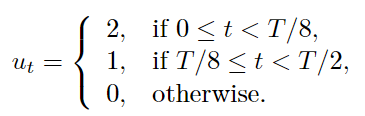
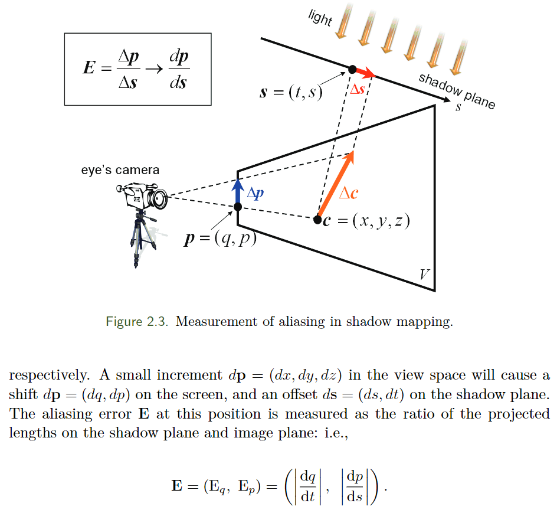
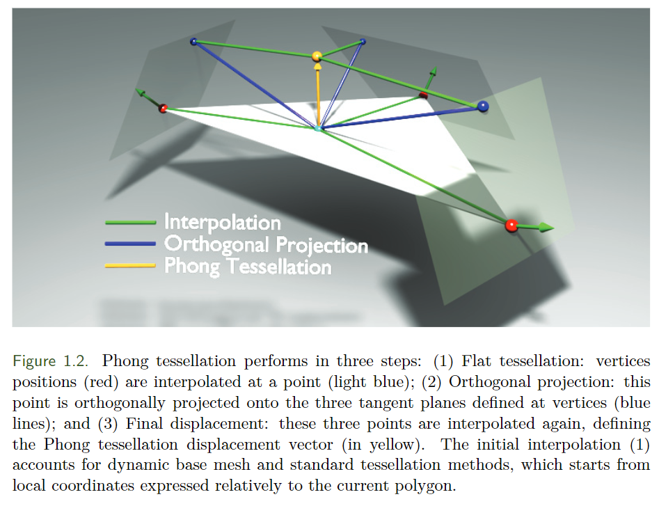
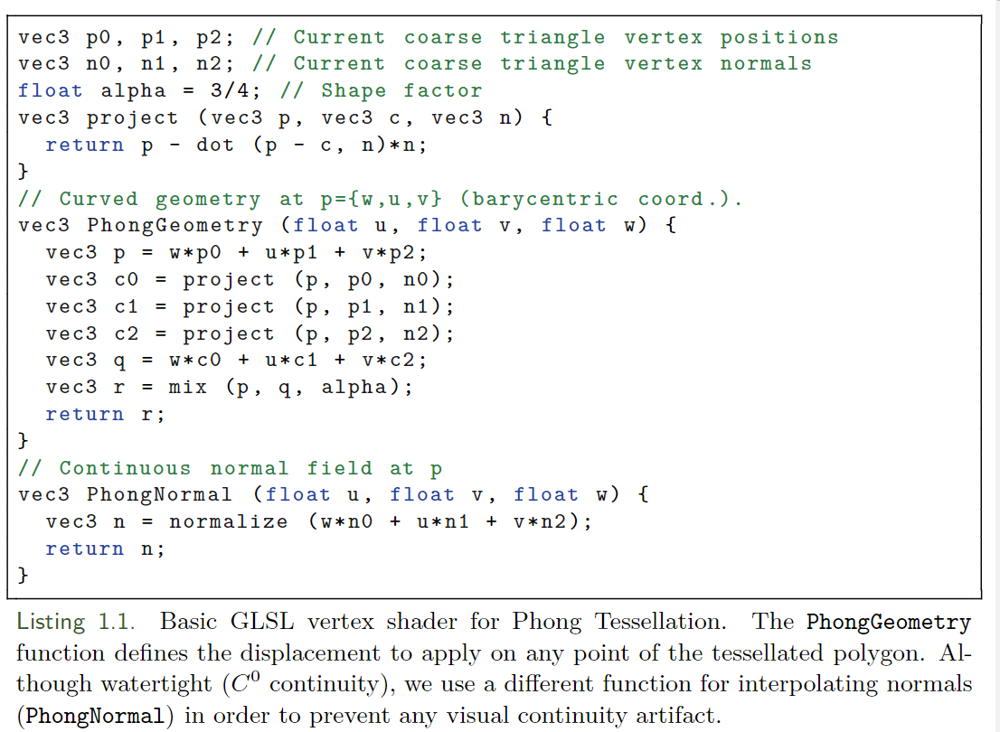
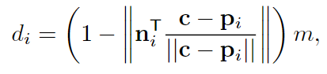
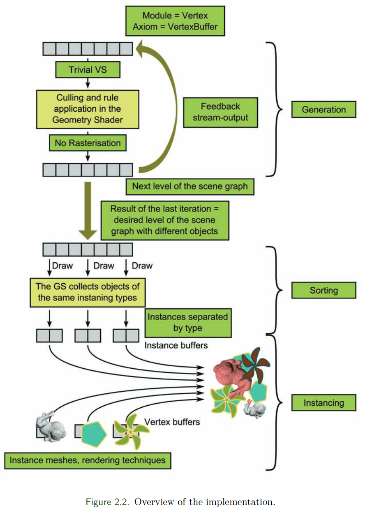

# GPU-Pro-GPU-Zen-note

## GPU Pro 1

#### GPU color Quantization

​    在GPU显存，带宽瓶颈的时候，可以考虑对颜色降维，例如调色盘技术。这个算法就是对调色盘来做量化的，如何选取视觉效果上更加接近于不做优化的调色盘。

​    这个算法是在vertex shader做的，使用了一个叫做SOM的迭代算法。这个迭代算法的步骤是：

1. 设置一个最大迭代次数T，设置第一次迭代的index t为0，隔壁ut的大小是一个随着t递减的数：

   

2. 创建M个空的set

3. 对于每一个颜色向量xj，找到他最近的codevector ci(t), 并且把xj放到对应的set里面，

4. 更新codevector

5. 把t设置成t+1，然后从第二步继续迭代，直到t=T

突然就有一个想法， 如果顶点数很多，那么可以把顶点的color信息和texture存成一个调色板，节省内存和带宽。这种方法画质会受到损失

#### 调试 Shadow Map的效果

在这篇文章中，主要介绍的是使用混叠误差（aliasing errors）来对shadowmap效果做一个衡量，算法是当一个点的位置发生变化时，屏幕空间的变化量分别于shadowmap的变化量求偏导，然后输入到一个混叠函数E里面。通过判断混叠函数变小的时机，我们就可以定位发生混叠的情况。文章中利用这个公式，对三种情况作了衡量，一种是衡量当光方向发生变化时，曲面强度发生变化的数量。另一种是衡量混叠误差在视锥体变化时的分布，第三种是衡量混叠误差在视方向上的分布。

在这篇文章中，作者使用混叠误差对几个算法的效果做了数学上的衡量，包括混叠误差在视角方向上的分布、在摄像机方向上的分布，在视锥体方向上的分布，得出一个总体结论。说明了某些算法使用的场景。混叠误差的计算很简单，是物体变化时，视角坐标系像素的变化与光源坐标系变化的偏导。

#### 交互应用中简单的曲面细分

这篇文章主要介绍了一种将GPU曲面细分简化的算法，这种算法是在vs里面做的。

线性细分算法是在三角形重心坐标系上线性生成顶点的：P(u, v) = (u, v, w)(Pi, Pj, Pk),ijk是原三角形的三个点，uvw是重心坐标系坐标。phone 细分也是这种流程，但是他在最后会做一个normalize：

n‘(u, v) = (u, v, w)(ni, nj, nk)T， n(u, v) = n' / ||n'||

在phone细分中，三角形的每一个顶点都定义了一个切线空间，然后算法在这三个点中做细分。具体步骤如下：

    

1. 三角形的三个点会生成一个中心点（浅蓝色）

2. 这个点会正交投影到三角形顶点的三个切平面
3. 这三个新的点会重新相交定义一个新的点（黄色）这个新的点，这个相交的地方是和一开始相交的点相同投影的
4. 对三个点的normal做插值，以保证连续性。

shader代码如下：

文章认为，可以先计算phone normalize ，normalize本身会给整个mesh一个曲面的效果，因此我们不需要给每一个位置再做phone tessellation。这个时候用到了adaptive Instanced Tessellation。这个才是算法快的原因，因为在保留形状的时候，尽可能少的生成三角形。其中最主要的适应性因子（adaptive factor）被定义成基于顶点法线的简单轮廓测量方法，是在粗网格顶点和边上定义的。从而能够让整个曲面保持曲面的形状。c是相机的位置，m是最大细化深度

思考：他其实是通过插值法线来做到曲面细分，每一个顶点的发现都是非常有必要的。

#### 基于规则的实时几何合成算法

这篇文章介绍了一种基于规则的实时合成并渲染的框架，几何合成非常迅速，并且不需要在CPU和GPU之间做内存拷贝。同时使用视锥剔除，这篇文章可以生成当前渲染所需要的物体（包括LOD）（类似于《我的世界》的功能）

这个论文的主流程是这样的：

1. 有一个模型库，各个模型都有它的id，都是一个节点。

2. 在绘制的时候，整个场景有一个rootnode，每一个模型都只依赖于它的父节点

3. 如果两个节点相互并不是后代，那他们可以被独立的评估。因此，我们可以用LOD的方式构建整个场景，并且在同一个level中所有操作可以并行。

4. 同时如果我们从一个中间节点开始生成的话，和从root重新生成的结果是一样的，这样我们就可以使用增量式的生成方式，缓存树形结构中的一大部分数据。

   算法实现的流程如下：

   

当然里面还有很多细节，我没有仔细看，有兴趣的可以直接看下原文

#### NURBS 几何评估与渲染

