这个repo主要记录自己看到的一些知识点，防止以后忘记，都是一些概述性质的东西，建议想要系统学习知识的话，还是看相关的论文或者官方文档

**MeshShader**：  

```
其实就是一个专门用来替代GS的,  用法和CS一样，比传统的GPU Driven的对三角形的裁剪、剔除优势的地方在于：不需要写入memory，直接在管线里面做了。以后做GPU Driven就再也不用先用CS做剔除，把剔除后的结果存放到 storage buffer 然后输入到VS里面了。meshshader可以直接搞定光栅化之前的所有流程。
MeshShader的具体流程大概是：先把原始的mesh分成多个meshlets（这个是需要预计算的，或者load模型的时候计算）（像GPU Driven里面的clusters簇）每一个meshlet其实都有自己的VB和IB（index是从0开始的）每一个meshshader线程组都会处理一个meshlet。然后每一个meshlet输入到task shader里面（可以跳过），taskshader用于提前剔除整个meshlets（cluster culling），或者做一些LOD和曲面细分的操作。然后taskshader会调用很多mesh shader。mesh shader里面的操作就和CS一样了，主要做三角形级别的裁剪剔除（包括视锥体裁剪、亚像素级裁剪等）。

一句话总结：：Meshshader最主要的贡献就是替代了GPU Driven的CS，并且不用写内存，高效的裁剪剔除避免了quad overdraw等overdraw。
参考链接：
http://meshshading.vzout.com/mesh_shading.pdf
https://developer.nvidia.com/blog/introduction-turing-mesh-shaders/
https://zhuanlan.zhihu.com/p/110404763
```


**UE5的Nanite**

```
写到mesh shader就想稍微说一下UE5的Nanite，因为在源码没放出来之前，大家都以为Nanite是用mesh shader做的东西。事实上Nanite和Mesh shader还是有区别的，Nanite用的是CS软实现了一套mesh shader的功能（估计是为了跨平台），他是用GPU Driven的思路，用CS实现了对三角形的culling和VS的一部分，然后送入到管线下游。很显然这样做需要大量的存储空间存储模型数据，所以Nanite使用了流式加载、层级cluster（类似于LOD，这里用到了Quadric Error的简模算法）、数据量化压缩（因为三角形很小，压缩对画质影响不大）等方法。渲染时候通过屏幕投影确定cluster的层级，mesh使用了Strip(三角形流与顶点重排)，并且使用了莫顿码重拍保证空间邻近性，如下图。还用到了kd-tree来高效的culling(层级cluster只是为了LOD)。做完上面这些操作后，Nanite还做了一个混合光栅化，比较小的三角形走软件光栅化（防止quad overdraw），比较大的三角形走硬件光栅化。

代码是对着知乎看的，还没看完，详细的实现方式以后再补（flag）

一句话总结：Nanite用的是CS软实现了一套mesh shader的功能（估计是为了跨平台），他是用GPU Driven的思路，用CS实现了对三角形的culling和VS的一部分以及光栅化的一部分。
参考资料：
https://zhuanlan.zhihu.com/p/376267968
```


**Bindless**

```
Bindless是说直接把buffer/texture等资源的虚拟地址存储在bindless buffer的功能，在shader中索引bindless就可以获取资源了。主要是解决绑定资源到管线的开销（状态切换开销太大了），减少drawcall数量的目的（利于合批）。下图中左边是原始的管线流程，右边是bindless

实际上在实现的时候，就是一个可以是任意类型的资源数组，在descriptor中不需要制定数组大小，也不需要指定资源类型。
参考链接：https://zhuanlan.zhihu.com/p/136449475
https://zhuanlan.zhihu.com/p/94468215
```


**PCF**

```
percentage closer Filtering，是一种滤波方式，主要是用来解决阴影的锯齿感，他是对shadow map采样的结果做滤波（不是对shadow map做滤波）。具体做法是，对某个要渲染的点p，查找shadowmap，同时对这个点周围的所有点查找shadow，最后用平均结果代表这个点的可见性.当然滤波核越大，最后得到的阴影越软（虽然它本意并不是做软阴影）
```


**PCSS**

```
和PCF不一样，PCSS是一种软阴影的实现方式。他的实现思路是基于距离的，如下图所示。1. 要搜索到所有遮挡物，并且找到在一定范围内所有遮挡物的平均深度。2. 通过相似三角形估计软阴影的范围。3.通过软阴影的范围来用不同的PCF滤波核，使用PCF来做滤波。
PCSS的思路就是，遮挡物距离阴影越近，阴影越硬，反之越远。
参考文献：https://sites.cs.ucsb.edu/~lingqi/teaching/games202.html
```


**VSM、VSSM**

```
Variance Soft Shadow Mapping，是一种对PCSS的近似，速度更快。他的思想也很简单，是为了简化遮挡物距离的计算开销，并且简化PCSS中第三步PCF的计算开销。VSM存了两个buffer，一个是depth buffer，另一个是depth*depth的buffer，这两个buffer可以存成SAT（summed area table）。
1. 计算一定范围内遮挡物平均距离：假设在一个filter的blocker里，所有大于t的值都等于t，计算所有大于shading point（t）的平均距离，再用1-P(x>t)得到小于t的遮挡物的平均距离，计算开销O(1),如下图所示
2. 和PCSS一样，根据遮挡物平均距离计算出filter范围的大小
3. 因为我们有任意矩形的depth*depth和depth的SAT，所以可以通过这两个buffer算出任意矩形中的depth均值μ和方差σ，又知道采样点t的深度，所以可以直接用切比雪夫不等式P(x>t)≤(σ*σ)/(σ*σ+(t-μ)*(t-μ))计算大于采样点深度t的概率，用这个概率作为采样点的值。计算复杂度O(1)

因为VSM做了很多假设，所以VSM有一定的局限性，在遇到深度分布不均匀的时候（不够正态分布），就会出现错误。
参考文献：https://sites.cs.ucsb.edu/~lingqi/teaching/games202.html
```


**Moment Shadow Map、MSM**

```
MSM是VSM的一种效果上的改进，他采用了depth/depth2/depth3/depth4四个buffer，来做方差和均值计算，事实上VSM是只用了depth和depth2的特殊的MSM。但是MSM的存储消耗更大
```

**SDF、Distance Field、有向距离场、Distance Functions**

```
SDF表示的是距离这个点最近的物体边缘的距离，
1. 可以用来做两个物体的blending
2. 可以做ray matching（步进的时候知道所在点的距离场值，就说明在这个值内没有物体，可以放心往前走）
3. 可以计算某个方向的遮挡角度，如下图所示,从而衍生出了基于SDF的软阴影。基于SDF的软阴影采用了系数k对arcsin的近似，k值越大，阴影越硬（θ角小，sin值小）
参考文献：https://sites.cs.ucsb.edu/~lingqi/teaching/games202.html
```


**Split Sum、环境光照**

```
环境光照实际上存了两个信息，一个是光照信息，另一个是BRDF信息，在渲染方程里面是光照信息和BRDF乘起来和visibility一起积分的。环境光照做了一个近似，把光照信息和BRDF拆开分别积分，并且存成两张图来计算光照。那么问题就简化成如何生成这两张图：
1. 光照信息只要一个入射光颜色，一个入射角就可以存成一个buffer。这个buffer可以是一个球因为做了近似，所以glossy BRDF的lobe是有一定方向的，我们就需要对这个buffer做prefilter，这样本质上就是在一个点上采样一个范围的颜色。如下图所示
2. BRDF有五维信息需要积分（菲涅尔项（反射率RGB，入射角度）、roughness），需要做的就是把里面的项拆出来，然后存成一个table。这里面应用了schlick的近似把反射率RGB三个通道拆成了一个R0和一个入射角度，这样把R0这个常数拆出来，整个BRDF就变成了入射角度和roughness的函数，把入射角度和roughness的积分预计算存成一个二维的texture，就把整个BRDF解决掉了。
参考文献：https://sites.cs.ucsb.edu/~lingqi/teaching/games202.html
```


**SH、球谐光照、球谐函数**

```
球谐函数可以理解为一个高维的傅里叶变换。他有一组基函数，然后把我们计算出来的光照BRDF展开（投影）到基函数上，存储起来。SH有一些有意思的特征，包括旋转不变性。光照是可以旋转的
```

**PRT**

```
PRT在diffuse下：
diffuse BRDF项是比较低频的，而SH本身可以表示从低频到高频的信息，因此可以把BRDF投影到3阶SH上面（后面几阶描述的是高频信息，对于diffuse BRDF没有影响），而既然材质都是diffuse了，光照信息也可以不要高频信息。可以直接用SH来表示光照。
对于下图的渲染方程来说，环境光照的做法其实是把lighting项、visibility项和BRDF项都看成一个球面函数，然后对于每一个shading point把这三项乘起来，然后对四面八方的光线的贡献加权平均。这样做很耗时.PRT的做法是，把BRDF项（常数）拆出来，把光照用球谐基函数表示出来，带入到渲染方程当中，把基函数、visibility项和角度一起积分，就相当于是把后者又投影到基函数上，这样对于每一个shading point就可以存两个球谐函数系数的图，渲染的时候把这两个texture的值乘起来就好了。如下图所示

PRT假设光照是可以变化的，但是物体都是不能变化的。
参考文献：https://sites.cs.ucsb.edu/~lingqi/teaching/games202.html
```


```
PRT在glossy下：
glossy下和diffuse下唯一不同的一点是BRDF不再是一个常数了，而是一个关于方向的函数，如下图所示，那么其实把之前Precompute的东西弄成一个矩阵就行了（原来是关于系数的一个向量）,那么原来的两个texture，可能一个texture存9个系数就行（3阶SH），变成了一个要存25个系数（5阶SH，glossy有高频信息，需要阶数更高），另一个要存625个系数（25*25，是一个矩阵），在实际渲染的时候，每一个shading point只需要把矩阵和向量乘一下就行了，如下图所示
因此PRT不是很适合做glossy材质，可以用小波变换来代替SH来表示glossy，但是小波变换不支持快速旋转
```


**RSM（reflection shadow map）**

```
把每一个shadow map上的像素都当成次级光源，并且把所有的反射物（次级光源当成diffuse的），然后用这些次级光源照亮shading point.当然shadowmap上需要存一些每个点的世界坐标，用来判断和shading point的距离。
这样其实就很简单了，查找所有shadowmap上距离shading point比较近的点，然后乘一个常数（diffuse）再做积分。把Visibility忽略掉，就得到了下图中白色的式子。每一个shading point直接就可以算出来颜色。
RSM和VPL的思想很相近。
缺点：漏光、没有可见性检测，认为每一个次级光源都是diffuse的，
优点：实现简单
参考文献：https://sites.cs.ucsb.edu/~lingqi/teaching/games202.html
```


**LPV、light propagation volumes**

```
1. 整体思路是把整个场景划分成多个格子，然后找到所有直接光照找到的表面，作为次级光源（可以用RSM实现）
2. 查找每一个格子都包含哪些次级光源，计算每一个格子向各个方向的radiance和，并且用SH表示
3. 根据第二步每一个格子的SH，向各个相邻格子传播，或者说对于每一个格子，查找他相邻格子传播过来的光照。同时用SH表示，一般迭代四五次就稳定了
4. 对于每一个shading point，查找他在哪个格子里面，用格子里面的radiance渲染这个shading point的间接光照
5. 格子可以使用层次结构加速

缺点：不考虑每个格子里面的遮挡，传播时候格子之间的遮挡等,如下图所示
参考文献：https://sites.cs.ucsb.edu/~lingqi/teaching/games202.html
```


**VXGI、SVOGI、voxel global illumination**

```
把场景分割成体素，组成层次结构，次级光源是体素而不是像素。
1. 决定了哪些voxel里面有次级光源，每一个voxel里面记录一个输入光照的分布，一个法线分布，每个hierarchy层都要更新
2. 在渲染的时候，我们从camera发射多条光线，对于任意一个pixel，我们知道camera ray的方向，还知道这个pixel的材质和法线，那么就能得到出射光线的cone，我们根据hierarchy的体素信息，把圆锥往前步进，收集所有次级光源对这个方向上的影响。最后渲染到shading point上。
缺点：开销太大，动态物体每帧都要体素花，开销太大
优点：质量好
参考文献：https://sites.cs.ucsb.edu/~lingqi/teaching/games202.html
```


**SSDO/screenspace directional occlusion**

```
SSDO和SSAO的思路完全相反,SSAO认为光源是从很远的地方来，周围的地方会挡道光。SSDO则是考虑了来自近处的光照，远处的光照只考虑直接光照。其他的做法完全一样。
SSDO有一个假设，就是采样点能不能被shading point看到，取决于采样点能不能被摄像机看到。如果被挡住了，并没有简单的扔掉，而是计算这些被挡住的点对shading point的贡献
缺点：只在屏幕空间做，不看visibility
```

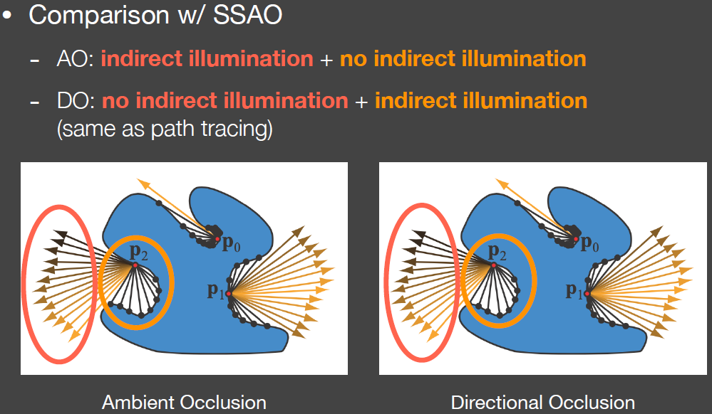

**SSR、Screen Space Reflection、 Screen Space RayTracing**

```
SSR的思路很简单，就是利用GBuffer里面的normalbuffer和depthbuffer，从屏幕空间发出光线，射向各个glossy的表面，并且在知道法线分布和摄像机入射方向时，知道出射方向，利用depth的mipmap使用指数增强算法（1,2,4,8）向前trace（因为这个时候没有SDF）直到trace到屏幕上另一个点，用另一个点的渲染作为颜色。因为采样开销很大，所以会使用时间和空间上复用采样。如下图所示
```


**GGX**

```
其实就是一个法线分布函数，如下图所示。他的特点在于他在边缘衰减比较慢，会有一个光晕的效果。在diffuse下会更亮一点
```


**GTR**

```
GTR是一种更通用化的GGT，有一个参数可以调整，在很高的时候接近backmann分布，在比较低时为GGX法线分布模型,如下图所示
```


**kulla-Conty近似**

```
在微表面模型中，微表面之间会相互遮挡，因此visibility项的存在会产生光线在微表面之间相互bounce，如果我们只bounce，就会导致能量损失，最后渲染出来的图会比较暗，kulla-conty就是对多次bounce的结果做近似
他的思想也很简单，先计算一次bounce的结果,把一次bounce的能量嘉和记为E(u0)，然后用1-E(u0)就表示损失的能量，使用一个系数来补充这些能量。这个系数的计算比较麻烦，需要存成一张texture，这些texture保存的就是这些系数（一个是u0，一个是roughness）。
对于有颜色的BRDF，会认为颜色本身就是对能量的吸收，最后会乘上一个颜色系数。
```

**LTC、Linearly Transformed Cosines**

```
线性变换的余弦，是为了解决在多边形光源下，如何做GGX法线分布的渲染。他的思想很简单，就是预计算出了一个transform，把所有点的BRDF转换成二维cos lobe，然后面光源会跟着这个变换做变换。这样就把所有shading point的BRDF都变化成一致的（原本不同的shading point的BRDF是各不相同的，这样给定任意一个面光源，不同的shading point都要做不同的积分，很麻烦），而现在BRDF就变成了一个固定的cos值，而面光源不变，这样就可以对面光源做积分。可以实现对于任意的BRDF，任意的面光源，得到最终的渲染值。具体的方法和解析解如下图
```


**GTAO**

```
GTAO和HBAO的做法有点像，不过HBAO是在水平面上找四个方向上的遮挡角度，GTAO是把半球面切成片，然后在片上找到可见性角度，然后做积分。最后得到的是各个切面上积分的AO值，最后把所有切面的AO再积分起来就得到最终的AO值，实际操作是把物体表面的法线投影到切面上。
在specular表面上的GTSO则是用splitsum类似的做法，只不过把漫反射系数和visibility给拆出来，再次做一个积分，相当于是做三张表，如下图所示
参考文献：https://zhuanlan.zhihu.com/p/342210503
https://www.activision.com/cdn/research/PracticalRealtimeStrategiesTRfinal.pdf
```

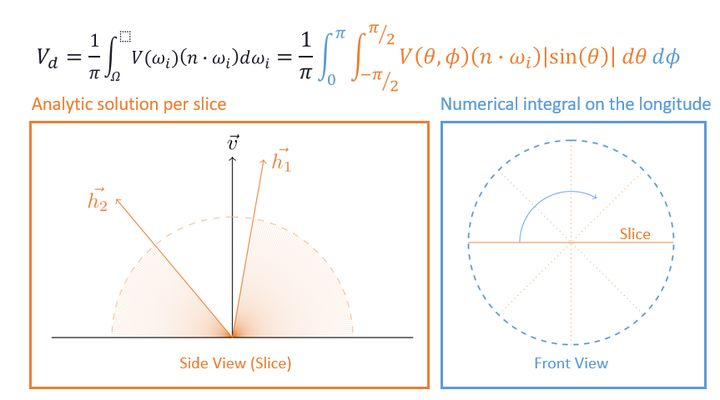

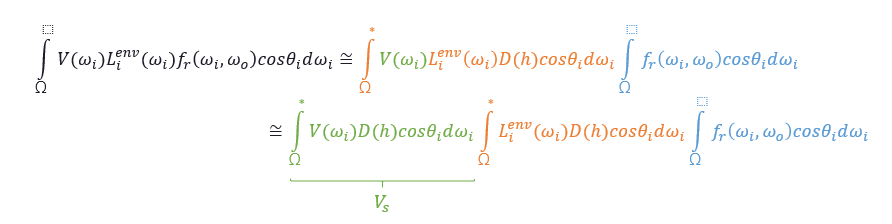

**体积雾渲染**

```
首先把场景体素化， 
摄像机发出光线，对于穿过的路径，对每一个voxel计算介质的散射系数，吸收率。把光照强度累加到voxel上面。最终形成一张3D纹理，在最后渲染的时候，根据像素点的世界坐标，对3Dtexture做采样。

对于体积阴影来说，使用另一个3D texture，保存光源附近空间的穿透信息，然后把粒子体素化，做raymarching，把穿透率写入到这个3Dtexture里面，这个3Dtexture作为volumn shadow map使用
参考链接：https://zhuanlan.zhihu.com/p/366083234
```

**MLAA**

```
MLAA是一个后处理的抗锯齿技术，他的思想很简单，是对锯齿边缘做矢量化，然后根据矢量化线的结果，计算覆盖像素的面积，根据不同的面积来采用不同的颜色值，如下图所示
具体做法是：
1. 计算每个像素的亮度，或者获得每个像素的深度值，或者在有G-Buffer的时候判断材质ID
2. 对每个像素点的左边和上边计算是否是边界（边界共享，不需要计算每个像素的四个边）
3. 对当前计算的边界线两遍做搜索，获得一个dleft和dright，然后计算连线矢量
4. 根据连线矢量，计算每一个像素点的覆盖率。预计算一张贴图，根据矢量情况查找像素点覆盖率，并查找对应颜色。
参考链接：https://zhuanlan.zhihu.com/p/342211163
```

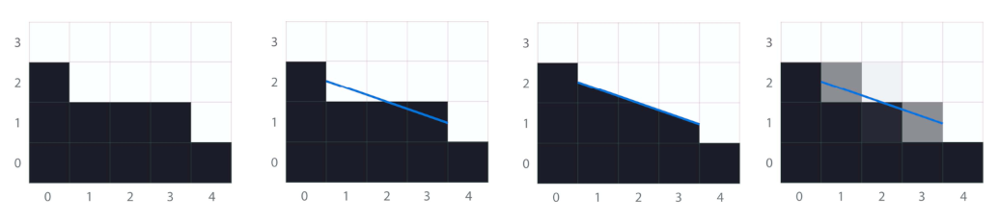

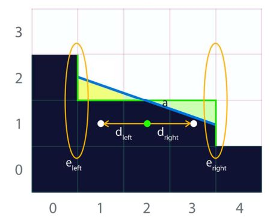

**SMAA**

```
SMAA是MLAA的改进版，他有以下改进：
1. 因为要计算边界，MLAA经常会误判，比如在一些光照变化剧烈的地方，MLAA会认为里面都是边界（亮度变化超过MLAA设置的阈值。SMAA会在判断为边界的时候向外再判断一个像素点（亮度是否是等差数列）
2. MLAA会把正方形的棱角认为成边界，SMAA则会在判断是边界的时候，沿着交叉边界再往外判断一个像素点，如果取不到边界，则认为需要AA处理。如下图所示：
3. 对对角线边界更加友好（计算量也会加大）
4. 边界搜索的更清楚，不会遗漏一些边界
5. 可以和MSAA、FXAA。TAA结合。
整体来说，SMAA的计算量更大，效果更好，可以根据不同情况选择
速度上：FXAA>MLAA>SMAA
效果上  SMAA>MLAA>FXAA
参考链接：https://zhuanlan.zhihu.com/p/342211163
```

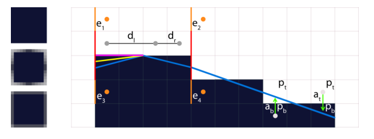

**ClipMap**

```
ClipMap的核心思想非常简单，就是把大于一定大小的Mipmap给裁掉，只保留视野范围内的部分。当视野发生变化的时候，就改变加载的clipmap，这样的办法可以动态加载texture，是VT的基础。
```

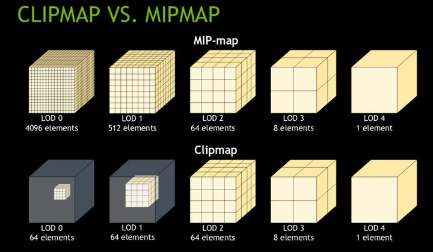

**双边滤波，Bilateral filtering**

```
双边滤波是为了解决高斯滤波丢失高频信息（边界变糊）的问题，具体的思路就是比较相邻的像素i和j之间颜色的差距，如果两个像素差距很大，则不做滤波。公式如下：其中i,j是第一个像素点的xy位置，kl是另一个像素点的位置。I表示两个像素之间的亮度值
```

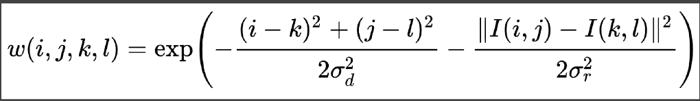

**联合双边滤波**

```
实际上就是加入距离，像素颜色差距以外的滤波限制条件，联合双边滤波非常适合光线追踪的降噪，（包括GBuffer里面的normal，depth，position，objectID等。
```

**Outlier Removal**

```
删除超级亮的点，在采样的时候，会有多跟光线都采样到同一个像素，这样就会让某些像素的点颜色值超过255。在渲染的时候应该查找这些亮点周围的像素点，用联合双边滤波clamp到一个有效的范围内，TAA就是这么做的。
```

**SVGF**

```
Spatiotemporal Variance-Guided Filtering，其实就是结合时间和空间上的信息一起做Filter，然后利用Variance去影响空间上的Filter。实现降噪
SVGF用了几个双边滤波的参数：
1. 深度：
考虑两个点沿着法线方向的深度差异
2. 法线
这里面的法线指的是两个
3. 颜色：
基于时空variance的颜色差异.这里算颜色差异是先计算着色点周围7x7像素值的方差，
然后在时域上根据motion vector 找到对应的像素点，然后得到一个比较平滑的variance
最后再在3x3的范围内再做一个variance，让variance更加平滑。

SVGF也有他自己的问题，包括过渡平滑丢失了一些高频信息，也会过滤不掉一些低频噪声。所以后来又有ASVGF等算法来做改进。
```

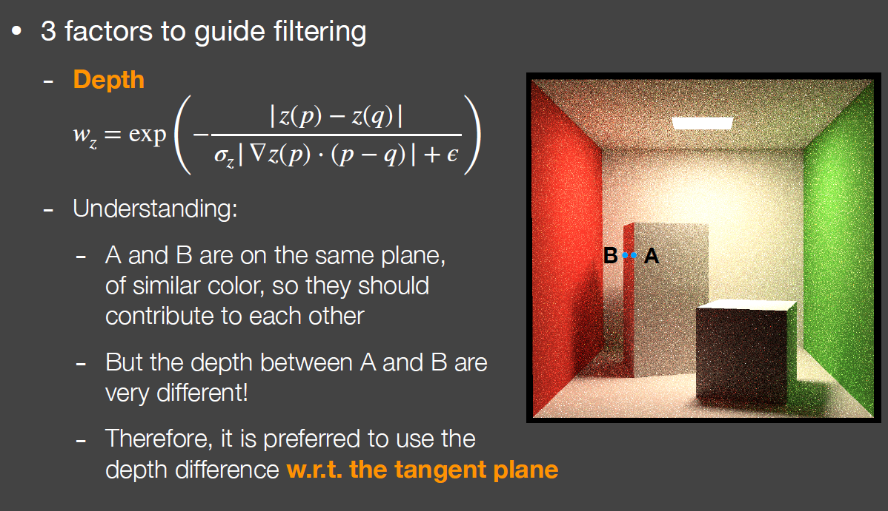

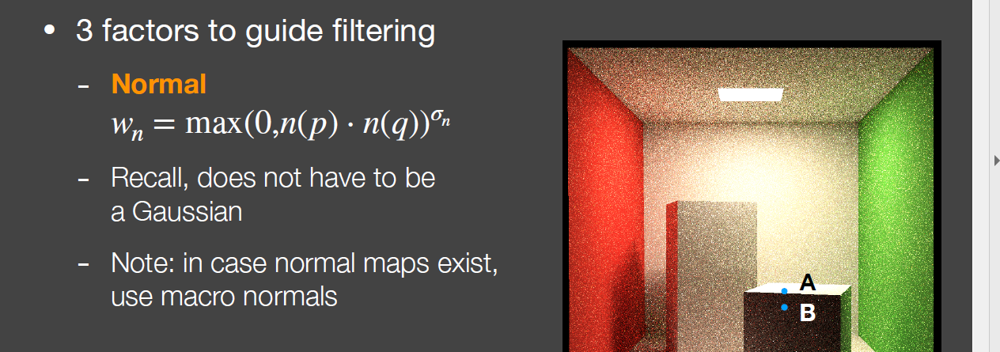


**RAE**

```
Recurrent AutoEncoder，这里是用神经网络来做降噪，输入是一个有噪声的图和一个Gbuffer，输出是一个视频的ground truth，网络结构如下所示：
整体上RAE的效果较SVGF慢，也有残影，也存在严重的overblur，效果不如SVGF
RAE的好处在于，在任何SPP下的效果都是一样的，而SVGF会随着spp的增加而计算量增加。而且今后有tensorcore后前景会越来越明朗。
```

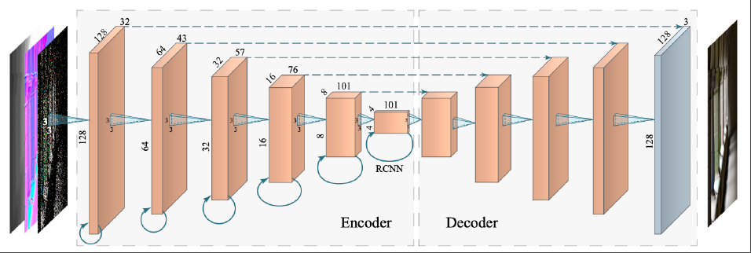

**Lumen简析**

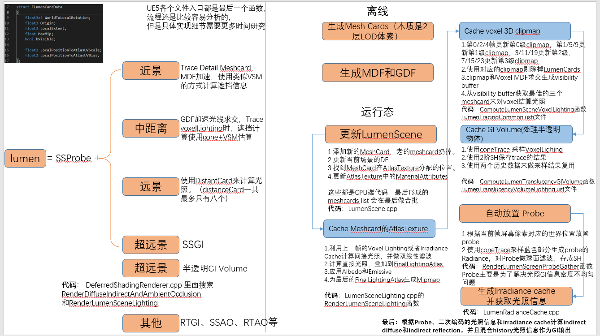

**管线瓶颈定位技巧**

| 瓶颈             | 定位方法                                                     | 解决方案                                                     |
| ---------------- | :----------------------------------------------------------- | ------------------------------------------------------------ |
| buffer带宽瓶颈   | 改变color和depth的位深度，32bits → 16 bits，或者修改GPU显存频率 | 优先渲染深度，减少alpha混合，尽可能关闭**深度写入**，从前到后渲染， |
| texture带宽瓶颈  | 把Mipmap的级别全改成0或者全改成最粗糙的级别                  | 减小texture尺寸、压缩纹理，使用更小的bits数量，使用mipmap    |
| PS、FS瓶颈       | 1. 先排除buffer带宽瓶颈，再改变分辨率，看看是否出现帧率变化。2.改变fragment shader（不能改变过多）防止原来不是瓶颈，改完以后变成瓶颈。3.改变GPU 频率 | early-z，backface-cull、避免使用半透明、使用显卡内部的原生纹理格式，纹理压缩，使用LUT代替计算，在VS里面 尽可能的算出来，避免normalize， |
| 顶点传输阶段瓶颈 | 调整顶点格式大小                                             | 压缩顶点格式，使用低精度数据，index使用16bit，连续存储数据，顶点排序 |
| VS阶段瓶颈定位   | 改变VS的复杂度（一般VS瓶颈说明三角形数量很多很小，并且cull掉了很多） | LOD，用CPU代替GPU运算，尽量提前break运算，                   |
| CPU瓶颈          | CPU频点调整                                                  | 合批操作，SIMD，尽量避免数据格式转换，避免除法、sin cos等三角函数，尽量内联，使用float代替double，避免虚函数，动态转换等 |
| CPU端的DDR瓶颈   | 先用color和depth的位深度排除buffer瓶颈，用Mipmap排除texture瓶颈，然后降低DDR频点， | 数据连续存储，ECS架构，避免使用指针等有跳转的数据结构，最好使用内存池，自己控制内存，尽量避免频繁释放申请内存，对数据使用不同的组织方式 |
|                  |                                                              |                                                              |

**水体渲染**

```
几何：
实时渲染中，水体渲染主要有两种方法，一种是对水面网格做偏移，另一种是对水面网格的法线做扰动，而本质都是把某种波叠加到高度图上，然后把高度图应用到水面网格上。对于比较平静的水面，用正弦余弦波就可以模拟，对于惊涛骇浪的水面，可以用Gerstner波。
目前算力高了以后，可以使用基于FFT的水体，具体做法是，从测量数据得出海浪的频谱，然后执行逆FFT，把数据转换到空间域，生成位移贴图，然后在实时计算的时候使用位移贴图来模拟真实感水面。
另一种流派是基于波动粒子理论，用于可交互的水面渲染，波动粒子表示，每一个波浪都是由波动粒子组成，水面向外扩散的过程，就相当于粒子不断增加，且振动幅度不断减小的过程（当粒子之间的距离大于一定值，就会产生新的粒子，且各个粒子之间的振幅会降低），波动粒子流派后来演化出了水波小包变换方法
另一种是基于物理公式的几何，这种经常用于离线渲染。
渲染：
1. 使用基于深度的LUT来模拟水面的深度颜色
2. 使用次表面散射的近似公式
白沫：
创建一个白沫纹理，高于某一高度的顶点，用这个纹理做渲染。
```

**DLSS**

DLSS有DLSS1.0,和DLSS2.0两个方案，他最主要的思想是利用时域信息，找到上一帧和这一帧采样值之间的采样频率，并且在频域上复现

**Bent Normal**

BentNormal 叫做环境法线、经常用于AO。他本质是对原始的normal修改后的新向量。这个新向量指向了当前像素一个不被其他物体遮挡的平均方向，也就是光线传入的主要方向，所以他可以用来修正AO，如下图所示，Normal和Bent normal的区别。一般bent normal是采用传统的离线采样方法，或者使用screen space的方法（类似SSAO）


**cluster -deferred shading 对light的culling**

