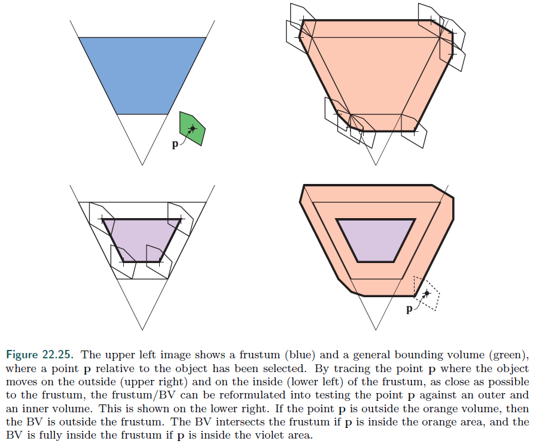
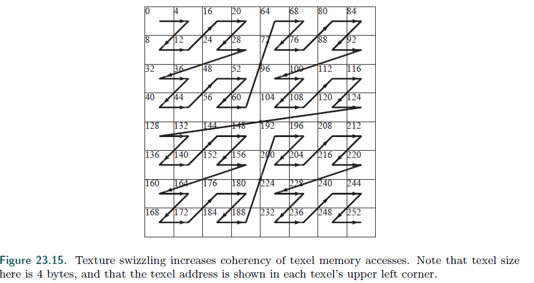

# realtime_rendering_4th_note

##### GPU的warp是什么

##### triangle  set 和triangle traverse分别有什么用

##### stencil test 经常用来做特效

##### vertex shader 以前真的是用来做shader的，而不是用来单纯的做vertex变换

##### 根据曲面公式生成三角形，geometry shader生成顶点

##### streamoutput用于生成粒子

##### 粒子模拟

##### geometry用于粒子生成

##### vertex shader的常用用途

##### 什么是geometry shader

##### 什么是tessellation

##### morphing

##### shear matrix

##### 直接光、点光源和聚光灯

##### MSAA的实现方式

```
MSAA在每个像素点会存四个不同采样点的depth和color，所以事实上depth和color的大小会是原来的n倍，为了减少这样的消耗，AMD和NVIDIA自研GPU会把四个像素点用table存起来，压缩成两个color和depth，然后四个点用一个bit索引depth和color。这样做在一个像素点有三个以上三角形的时候会出现问题，不过因为这种情况比较少，所以实际上效果不错。
```
```
MSAA比SSAA效率高的原因还有原来SSAA需要两遍pass，而MSAA只需要一遍pass，要注意MSAA实际上会经历光栅化、FS 2个阶段，因为只有通过depth的像素点才会用来做MSAA
```
```
在做MSAA+HDR的时候，经常会遇到tone-map的问题，因为每一个sample的color都要提前做tone-mapping，而tone-mapping的消耗很大，相当于做了四次tone-mapping。
```

##### TAA的实现方式

```
相机抖动：相机抖动是 TAA 能够反走样最本质原因。相机随时间抖动过程中，引入了额外的子像素信息，对子像素的融合，使我们在时域上获得超采样的效果，静态场景中效果与 SSAA 一致。

在抖动过程当中，上一帧和下一帧的像素点是不对应起来的，为了解决这个问题，TAA一定会使用motion vector。

即使使用了motion vector，但是仍然会让像素没办法一一映射，所以就出现了残影，解决残影的办法是：计算当前像素及其邻域的均值及方差，历史颜色如果不在这个范围内，就直接在颜色空间做clip。motion vector实际上是使用3x3邻域最长的向量，这样可以减少motion vector的锯齿。
TAA和MSAA相反，适用于deferred shading，而MSAA只适用于forward。

解决TAA残影的另一个方法是对上一帧做reprojection，这样算出来的motion vector更准确
```

##### 关于采样模式

```
目前主流的4xMSAA采样模式都是一个旋转的正方形，但是事实越有规律的采样模式越容易出现摩尔纹，例如如果规规整整的从左上角采样到右下角（对角线上的四个点）效果肯定是不好的。所以说，如果想要更好的采样效果，必须要足够随机。有一种模式：给定16种采样模式，每一个像素点都用不同的采样模式

还有一些采样模式是在像素点的四个边缘的，这种模式也适用于TAA，即每一个边有一个采样点。在两帧的时候，一帧用其中一个采样点。
```

##### 关于粒子渲染

```
每一个课件的粒子都会在lightmap 上申请一个tile，每一个tile的大小和粒子的大小有关系，这样每一个粒子都渲染到这个tile上面，同时写入自己的世界坐标位置（per pixel）， CS会去根据环境贴图算每一个像素的radiance。最后根据每一个pixel渲染灯光。粒子产生的阴影则是通过渲染到一个texture上来做的（填一个基于像素的alpha值，这个值也可以是三通道颜色值），到最后这个texture会和shadowmap的可见性一起乘起来。
另一种绘制方式是FOM，他是将粒子首先从光源的位置以傅里叶级数的形式绘制到不透明度图上，最后从不透明度图上采样，获取光源信息，以绘制阴影
还有一种方式是把粒子用体素分解，然后在深度图中对每一个体素存成位置，成一个deep shadow map。然后做shadow cast
```

##### 纹理各向异性过滤

```
在多个texel映射到同一个像素时，一般是使用mipmap，mipmap一般是正方形采样，在长宽比不成比例时会出现远处像素点模糊的情况，例如隧道中，或者向前延伸的铁路。各向异性过滤的理念就是：在长宽上采样的比例不相同，在x轴采样更长的点，在y轴采样更少的点做平均，这样可以保证在远处的像素也可以很清晰。最常见的各向异性算法是积分图、以及无约束各向异性滤波
```

##### 关于光散：

```
从光散射的根本原理出发，光的散射计算应该是从视角到光源连成一条直线，在这个直线上的每一个粒子都产生散射，都有一个半透明度，光每穿过一个粒子都会做一个衰减。这个衰减以RGB的值体现。最后叠加到渲染图上，衰减的过程当中，phase function是最重要的东西，他可以指定一条光线经过一个粒子散射到各个方向的概率，phase function可以是各向同性的，光散射到各个方向的概率是相同的，还有其他不同的phase function。暂不介绍
```

##### 体积渲染

###### 大范围的雾

```
大范围的雾可以通过深度来模拟，根据雾的alpha值和颜色，根据depth buffer，在fb0上做操作，越深的地方alpha值越厚。这种方法还可以做遮挡剔除，太远的物体会被雾全部挡住。当然alpha和深度的关系可以用各种各样的函数来表示alpha = f(depth).除了depth based的雾以外，还有height based 的雾，这两种雾可以做一下结合
```
###### 基于体积的简单光照
```
散射光照同样可以基于粒子去做，画一堆mesh上去，也可以用后处理技术，下面就是一个后处理的光散射glsl
float inScattering (
vec3 rayStart , vec3 rayDir ,
vec3 lightPos , float rayDistance )
{
    // Calculate coefficients .
    vec3 q = rayStart - lightPos ;
    float b = dot(rayDir , q);
    float c = dot(q, q);
    float s = 1.0f / sqrt (c - b*b);
    // Factorize some components .
    float x = s * rayDistance ;
    float y = s * b;
    return s * atan ( (x) / (1.0 + (x + y) * y));
}
```
###### 动态天气、环境变化渲染
```
基本思路都是使用GPU模拟粒子，然后从屏幕空间发出多条射线，穿过volume，获取颜色和遮挡信息关系。
另一种做法是在光源散射的时候，把整个场景离散化成一个volume texture，并且map到相机裁剪空间，然后评估每一个voxel的世界空间坐标，这个volume texture存的是radiance（RGB空间）和一个消光系数（alpha通道），分辨率可以比屏幕空间小很多。最后在相机空间使用这个volume texture获得物理参数，最后做光散

```

##### 关于头发和毛发

```
头发和毛发本质是一样的，一般包含三个layer，最外层是不平滑的，拥有3度向外延伸的角度，如下图所示,第二层是颜色层，有的头发是黄色的，有的是黑色的。最中间一层叫做发髓，他是用来做头发动画的，在动物毛发中占据了比较重要的位置。
如果对效率要求不是特别高，可以使用一堆四边形加上一个丝带，类似于骨骼动画的的东西来模拟头发，，丝带表示谷歌，四边形表示的是头发。当然如果想要更精细的头发，就需要用很多很细小的四边形小丝带。然后用物理模拟，这些四边形小丝带肯定是半透明物体。因为这些四边形很小，所以一定要加抗锯齿处理，并且得从头皮开始画，画到最外边结束。一般头发使用的是BSDF模型
```


```
有人用R、TRT、TT三个分量表示来表示头发的渲染，其中R表示光打到头发上反射出来的光，TT表示经过头发透射出来的光，TRT表示光在头发中传播后出射出来的光。如果想要更物理的话，可以添加TR*T。在实时渲染当中，会把这些光的BSDF模型离线烘焙成一个LUT，然后使用LUT来渲染头发。这种使用texture的方法效果上比较欠缺，所以可以使用dual-scattering技术，这种技术使用了两个变量，一个是全局透射系数G，这个额G是通过组合渲染的像素和光源中间遇到的每根头发的BSDF来得到的，这个G可以用GPU做。结果存在一个texture上，例如deep opacity map。除了G以外，还需要一个L，用来近似当前渲染的位置散射到旁边的量。
当然头发可以用environment map来做，存到一个SH里面
```

#### 非真实感渲染

整体来说，我认为飞真实感渲染是拥有更强的颜色对比度，渐进色较少。

##### toon rendering style

```
toon 将三维模型和二维动画结合在一起，他有两种渲染模式，一种是使用纯色填充到网格中，当光源方向和mesh表面发现夹角小于一定值就用比较浅的颜色， 反之使用比较暗的颜色。更加复杂的渲染方式是对图像做后处理，把连续的值李三成一些tones，这样每一个颜色之间的变化就更明显了。
```

##### outline rendering

```
使用边缘渲染的算法大致分为：基于表面的渲染、过程式几何、图像处理、几何边缘检测，或者以上算法的混合。

有以下几种边缘可以在toon rendering中使用：
1. 不被两个三角形共享的边（border） 例如一片纸的边缘。
2. 折痕、硬边缘，这种边指的是被两个三角形共享，但是两个三角形之间的角度大于一定角，例如一个box有3. 一个折边。
4. 两个相同材质的三角形，但是艺术家想要显示的边缘，例如前额线，裤子的褶皱
5. contour edge 轮廓边缘，两个相邻三角形面向不同的方向
6、 silhouette edge轮廓边缘，例如两个不同的物体
```


```
基于几何的描边算法：
描边有很多种方法， 一种是正常渲染正面，然后把fontface culling打开只渲染背面，，背面做一个bias来绘制，然后再正常渲染正面。bias使用translating，或者polygonoffset，或者z-depth都可以完成。另一种方法是把每个背面三角形加宽，对每个边缘沿着vertex normals向外移动。
基于边缘检测的算法：
基于G-Buffer的边缘检测、可以对每一个像素记录一个物体的ID值，然后在渲染GBuffer的时候对ID值做采样，假如这个pixel的ID和旁边的不一样，那么这个像素就渲染成黑色。也可以对z-buffer做采样，加入相邻像素间的深度差高于某个阈值，就渲染成黑色。或者通过normal map 来做边缘检测，但是这些方法都有各自的缺点，例如一张纸放在桌子上，可能就检测不出来。所以需要多种方法混合一起用。一旦边缘检测找到了，就可以在pipeline上来修改这些边缘，例如降噪，模糊，来使边缘检测更加准确
几何的contour 边缘检测：
从contour边缘的定义出发，使用(n0  v)(n1  v) < 0;这样的方法检测边缘，但是更高效的方法是利用每一个物体的轮廓会形成一个封闭的圆环，被叫做contour loop，我们每帧都去跟踪这些loop，例如我们从一组循环开始，然后在摄像机移动时使用随机搜索算法更新这些loop。这种方法很快，但是不准确，而之前的方法很慢，但是准确。因此诞生了一种Hierarchical的方法。对于非动画模型，使用高斯映射的层次结构来确定轮廓边缘，或者使用n元树来做边缘检测。
把隐藏的边缘扔掉：
之前做的边缘检测，实际上有一些是不需要的，或者不可见的，使用z-buffer可以删掉那些不可见的边，然后采样专有的卡通渲染线的texture
```

##### Strock surface 风格（素描风格）

```
素描风格是把素描线存成一个texture里面，并且使用多个mipmap，这个mipmap实际上表达的是素描线的密度，
```

#### 多边形技术

本章主要讲述的是多边形的细分，合并，优化，简化和压缩（包括简模等）

##### 细分和三角形化

```
细分就是把一个多边形变成很多个小的多边形（多数时候是三角形），这有很多问题，比如四边形的四个点不共面，如下图所示：这种时候会把整个多边形投影到和他的法线垂直的一个面上，但是仍然有自相交问题。有一个算法叫ear clipping，他的做法是首先对于每一个三角形i/i+1/i+2，判断i/i+2边是否和其他三角形边相交，如果没有相交，则i+1建立了一个ear，并且吧这个ear移除（ear其实就是个三角形），直到所有的ear消失掉，就创立了一堆三角形。如下图所示。还有一种三角形化就是从0开始吧所有三角形都绘制一遍，被绘制偶数次的部分不绘制，如下面第三张图所示
```


##### 细分三角形带来的渲染问题

```
细分三角形可能会带来一些渲染问题，解决办法的关键思想是最小化新边上的顶点差异，选择顶点上没有其他数据的顶点作为切分的边，带来的问题如下所示：解决这种问题最好的办法还是重新生成uv坐标，或者使用双线性差值
```


##### T-vertex和边缘缝合：

```
这两个问题在简模的时候遇到过，因为两个细分曲面产生的边缘不一样，导致出现裂缝，需要吧边缘match起来，做缝合，可能还会出现T-顶点，导致出现渲染错误，这个时候就需要下图中吧db和bm连起来。
```


##### 合并算法

```
其实就是把顶点做了一个哈希，然后存成indexbuffer里面，这种操作叫merging，还有一种叫orientation，他是把所有的三角形都归一到同一个方向（区分三角形的内外部），具体做法是从任意一个三角形开始，看三角形的顶点顺序是否是顺时针的，然后再看相临边是不是顺时针的，直到遍历完所有的三角形。经过orientation，三角形的一边都是可见的了。

Solidity：

如果转换视角，经过orientation的mesh只有一个面能被看到，那这个mesh就被称为closed，这时候就可以开启backface culling。被两个三角形共享的边成为manifold.另外，对于曲面细分，增加边的时候，会导致顶点法线出现错误，如下图所示，可以通过评估每个三角形角的权重来控制normal的偏移
```


##### triangle fans

triangle fans指的是下面这个东西

##### 

##### triangle strips

triangle strips 指的是下面这个东西


```
不管是fans还是strips，都是可以通过ACMR(平均缓存未命中率)来提高cache效率的。顶点排序算法都是用来提高cache命中率的，从而提升整体性能。
```


##### 简模

```
把两个顶点连成的一条边扔掉，用其中一个顶点代替，这种方法不会改变顶点的位置，如下图所示。然后Heckbert就用了一个quadratic equation来衡量这个error，获得了不错的效果，但是也有可能会出现下面的情况,这种情况可以通过查看是否有三角形的法线翻转来检测。quadratic equation的表示为c(v) - sum(pow(ni * v + di, 2)),v是新的vertex，m表示影响到了m个平面，ni是第i个平面的法线，di是从原来算走了多远，例如下面这张图，从e到c的距离是0，从c到e的距离是1
```


##### 三角形压缩

```
类似于JPEG格式，对三角形数据做编码和解码。从而避免cache miss，并且节省带宽。最简单的压缩算法是固定压缩率的算法，例如用unsigned short 代替unsigned int表示indexbuffer。用unsigned byte代替float 表示RGB颜色，甚至不存储颜色，用索引来表示纹理里面的颜色。或者把顶点归一化后用unsigned byte表示，例如顶点的范围是193-293,那么让所有的顶点都减去193，以unsigned byte 存储，最后计算的时候再加上193即可
```


### 22 相交检测

常用方法是AABB，OBB，k-DOPs,  

##### picking

```
可以使用CPU+BVH做picking，但是如果物体比较多的话会很慢，而且也不是很准确，另一种方法是使用GPU，在用户点击某个pixel的时候，找到这个pixel对应的objectid，或者是对应的color identify。idbuffer可以用比较小的尺寸，甚至隔帧更新。对于摄像机不移动的场景（例如画图系统）整个buffer甚至可以只生成一次。

k-DOP(discrete oriented polytope)指的是把物体包围的k个平面，例如AABB和OBB本质是一个6-kop，因为他们都有6个面。
```


##### Separating Axis Test (SAT). 分割轴检测

```
任意两个凸几何体，一定存在一个平面，两个物体在这个平面上的投影是不相交的，但是凹的几何体不是这样，例如一个水井和一个水桶。对于两个凸的几何体，这个相隔的面有可能是A物体的一个面，也有可能是B物体的一个面，或者是，一个多面体的边缘形成的面。如下图所示：
```


##### 创建球状的BVH

```
最简单的方法是先创建一个AABB然后以这个AABB的中心点为中点，查找最长的半径，这个半径作为球状BVH。另一种方法是找到这个物体的minx，miny，minz，maxx，maxy，maxz，然后以xyz之间绝对值最大的轴的中间面的中间点作为圆心，得到了一个近似最优的球型BVH
```


##### **创建层次结构的BVH**

```
有人对BVH也做了一个层次结构，最外面的BVH是最简单的k-DOP，例如AABB，然后第二层BVH是一个较大K值的凸包，有相对比较多的面，最内层是模型本身的三角形面。这样一个层次结构会让计算更快。
```


##### 创建比较优秀的OBB

```
1985年有一个人用的方法是，先给一个物体创建一个convex hull，然后使用PCA对整个hull做降维。后来有人提出了更好的算法。1.对需要处理的物体创建一个k-DOP，然后找到所有相对面上的两个点，然后找到离这两个点连成的线最远的一个点，三个点组成一个三角形，然后以创建出的这个三角形的三个边为base，创建出三个OBB，找到一个最好的OBB，就是近似最优解。如下图所示：
```


##### 几何概率

```
这里的概率指的是一个光线和几何体相交的概率，在空间中指的是几何体在光线面上所占投影的面积比例，这种概率经常被用于SAH(surface area heuristic，表面积启发式)算法。
```


##### 快速求交的原则（技巧）

1. ```
   1. 对那些会轻易扔掉或者轻易保留的交叉点，应该尽早计算出来，越早越好
   2. 如果可能的话，利用之前的求交测试计算结果
   3. 如果用了多个求交测试算法，那可以尝试更改这些算法的顺序，有可能会出现意料之外高效的排列组合
   4. 把昂贵的计算推迟到后面，越靠后越好
   5. 求交问题可以通过降维来简化（例如把三维的求交问题转换成二维的）
   6. 如果只是单个光线/物体和其他所有物体作比较，需要看看能不能在测试前做一个预计算
   7. 不管求交计算多么费时，最好先使用球或者BVH做一个快速剔除
   8. 最好养成使用真实数据对求交做测试，查看在真实数据下各个求教算法的耗时情况
   9. 尽量从前一帧的结果中获取一些数据
   10. 对于GPU和SIMD指令，尽量避免if这种分支条件的出现，可以使用位操作来代替
   ```

   

##### 光线/球求交

光线和球相交的基本公式是：

f(P) = ||r(t) - c|| - r = 0,而光线是r(t) = o+t\*d，所以表达式将变成：||o+t\*d-c|| = r,化简将变成t\*t+2b\*t+c=0,其中b = d\*(o-c), c = (o-c)\*(o-c)-r\*r,这个方程的两个解就是光线和球的两个交点

另一种更快的方法是像下面这张图的做法，首先把光线的起始点o和圆心的距离l算出来，如果l比r小，就说明o在球内。然后计算l在光线前进方向上的投影d，记为s=l\*d，如果s<0则说明球在光线前进方向的反面，退出。否则利用勾股定理计算m = sqrt(l\*l-d\*d),如果m>r则说明没有相交。否则就需要再用勾股定理计算q，最后算出两个交点


##### 光线/box求交

```
一个比较简单的方法是光线和几个面求交点，然后比较几个交点,如下图就是一个二维的例子，三维的计算方式是：tmin = max(tumin, tvmin, twmin), tmax = min(tumax, tvmax, twmax),如果tmax比tmin小，就是没交到，反之就是交到了。另一种更快的方法是把物体投影到三个坐标系上，然后从射线看到这三个投影，必然会看到每个投影的两个最大点，如果相交的话，射线的角度一定在这两个最大点角度的中间。
```


##### 光线/三角形求交

```
光线和三角形求加通常被降维到二维空间做，把三角形和光线投影到三个xyz平面，然后我们在二维平面判断相交点是否在三角形里面。在二维空间上，我们用重心坐标来表示三角形的点，例如f(u, v)=(1-u-v)P0+uP1+vP2,那三角形和光线求交就变成了 o+td = (1-u-v)P0+uP1+vP2,具体求交做法如下图（下面是使用克莱姆法则做了加速以后的运算方式 
```


##### 光线/多边形求交

```
同样方法，计算光线和多边形所在平面的交点，然后把多边形和点映射到三个平面上。然后以这个相交点为起始，向一个方向（例如x轴做射线，看和几个多边形的边相交，如果是技术个，则说明在多边形里面，偶数个则在多边形外面
```


##### 平面/BOX求交

```
可以转换成OBB和plane求交，进而转换成OBB的8个点代入到平面方程当中，如果8个点都在平面的一面（all positive or all negative）则不想交，否则就相交了。或者从OBB的中心做平面的垂线，然后在计算这个OBB在这个垂线上的投影，比较两个长度，如下所示：
```


##### 三角形/三角形 求交

```
首先转换为一个三角形和另一个平面是否相交，如果相交了，再看另一个三角形和另一个平面是否相交。如果都相交了，则再看两个相交形成的线是否有重复的地方，有重复的地方，则说明两个三角形相交。

判断三角形和平面相交的办法是，把三角形的三个点都带入到平面方程里面，如果都是正或负，则说明不相交。然后会得到两个值，做两次判断以后，得到四个值，看着四个值是不是有交集即可
```


##### 三角形/BOX求交

```
这种求交主要在voxelization场景中应用，判断三角形面和一个voxel是不是相交。

这种求交，首先要判断AABB和三角形的AABB是不是相交，如果相交，则使用plane/BOX求交算法，查看三角形所在的平面和box是否相交，如果相交，则把box的六个面作为投影，把三角形投影到六个面上，然后查看是否相交、
```


##### AABB和球求交

```
实际上就是找AABB的中心，这个中心和球中心的距离，和AABB本身的对角线投影到这个连线上的距离作比较。
```


##### OBB和OBB求交

```
需要先把一个OBB变成AABB，另一个做同样的坐标变换，然后把两个AABB投影到坐标系上，看是否有不重叠的地方，如下所示：
```


##### 视锥体裁剪

```
通常情况下，引擎都会做视锥体裁剪，然后把视锥体和BVH树做求交运算，运算结果分为三类，一种是BVH树完全在视锥体外面，另一种是完全在视锥体里面，最后一种是BVH和视锥体相交。对于最后一种情况，需要遍历这个BVH节点的子节点，然后继续做求交运算。很明显，第三种情况是最费时的。

有一个比较巧妙的方法如下图所示，选择绿色物体中间的一个点P，然后在预计算的时候，让整个物体尽可能的靠近视锥体（但是不相交）p点随之会形成一个运动轨迹（一个大的视锥体）或者一个小的视锥体，然后在实时计算的时候，判断P点和两个视锥体之间的关系，就可以得到这个物体和视锥体的关系。这个绿色的物体,可以是一个球或者是一个AABB。剩下要做的就是得到视锥体的六个平面方程了。
```



### 23.图形硬件介绍

#### 光栅化

```
光栅化并不是逐像素点画的，而是逐quad画的，一个quad是一个2x2的框，所以我们应该尽量避免画过小的三角形，因为小三角形会造成quad overshading， 如下图所示
```


```
判断一个quad是否在一个三角形里面，只需要把距离三角形最近的那个quad的点算一下是不是在三角形边里面（e(x, y) >0) 。在triangle traversal 开始之前，GPU有一个triangle setup阶段，这个阶段会把整个三角形的信息都计算出来，例如三角形边的方程，一些插值的常数的计算等（例如重心坐标系的uv）。在视锥体做clipping是一个很费事的操作，所以要尽量避免full clipping？


另外texture的uv直接贴到图上是不对的，因为距离越远的物体占屏幕空间越小，会出现bias，所以我们必须通过w来做纠正，之前在做软件渲染器的时候遇到过这个bug。叫做perspective control，透视校正
```

##### 保守光栅化（conservative rasterization）

overestimated CR (OCR) and underestimated CR (UCR).概念如下图所示，其实就是把那些可光栅也可不光栅的像素点给排除掉或者全包含进来


#### 大规模计算和调度

```
在GPU里面一个ALU指的是相对大的一个概念，一个ALU可以是运行vertex或者fragment的一整个计算单元，包括了浮点计算单元，整数计算单元，结果队列等很多小组件。一些其他计算单元例如cos，sin等是单独列出来的。GPU的ALU也有很多个pipeline，但是不像CPU一样拥有branch prediction，register renaming、指令重拍等功能。这些省下来的空间都用来堆ALU的个数了。一般GPU都是把ALU弄成一组一组的，例如32个ALU一组，这32个ALU其实就是一个SIMD engine，叫做MP(multiprocessor)，LDA（local data storage），TX（texture units）。
```


```
一个MP还会有一个warp调度器，这个warp调度器是把所有GPU的任务做优先级排序，例如下游的工作优先级比上游高（pixel shader比vertex shader优先级高），或者如果当前的warp执行纹理加载指令（要等很久）warp调度器就会马上切换出当前的warp，换一个可以马上执行的warp。除此以外，因为一个warp是32个ALU，一个pixel quad是4个像素，所以一个warp可以同时执行8个quad，如果硬件实现一个warp只能pass同一个三角形，那么就会很浪费，所以通常一个warp可以同时处理很多三角形。
```

##### 延迟和占用（latency and occupancy）

```
延迟指的是从发出指令到实际看到这个指令效果的时间，我们需要把一些延迟比较大的操作给隐藏起来。

通常寄存器的占用率越高（大于一）越好，
```

##### 内存架构和带宽

```
一般texture和rt存在GPU 显存，一些多帧都不会变的buffer，例如VB和IB。那些经常发生变化的vertex和index，会使用dynamic vertex（index） buffer，这些放在系统内存，然后通过PCIE向GPU传输。对于主机，会使用一个unified memory architecture（UMA）， 意思是GPU可以使用所有的内存，CPU和GPU共享内存，如下所示，是一个intel Gen9的图形架构
```


##### Cache and Compression


```
cache作为一个高速缓存，因为大小有限，所以存储的是压缩后的数据，压缩过程中需要考虑单次传输数据的最小大小。例如，内存传输的最小大小是32Byte，有一个tile 的大小是64Byte，那么就只能选择压缩50%的算法，如果一个tile的大小是128Byte，那就可以选择压缩率75%，50%，和25%的算法。另外，clear操作会加快纹理读取速度，因为cache里面不需要再对compress的数据做解压，而是直接清除掉就好。
```

```
当硬件想要访问一个已经停止写入的RT时，需要先把数据从到compressor，这时候有一个压缩率更高的算法，因为API需要无损压缩，所以当所有无损压缩都失败的时候，则需要回退压缩后的数据。这意味着无损压缩不能减少内存使用量，只能减少带宽使用量。如果压缩成功了，则会把这个数据设置为已压缩，并且以已压缩的格式发送数据。否则则以未压缩的格式发送数据。
```

##### color buffer

```
RGB565之所以G是6位，是因为绿色对明亮度影响最高。

另外，在使用纹理的时候，尽量使用直接的uv，因为uv在光栅化的时候是使用du和dv，dxdy来做叠加的（因为除法比较慢）这些都是提前计算好的。一般GPU会有专门的硬件做texture cache，通常这些硬件都是用on-chip memory。为了保证cache的利用率，纹理通常以分块的形式进行，所以纹理并不是按照扫描线的结构存储，而是如下图所示的顺序存储。
```



##### 体系结构

```
对于图形学计算来说，串行计算的部分往往会成为整个pipeline的瓶颈，因此对所有任务做排序是很重要的，在并行计算架构中，有四种排序方法，分别是sort-first，sort-middle，sort-last fragment， sort-last image，如下图所示：
```


sort-first 架构会在几何阶段之前就对三角形排序，然后把屏幕分成几个小块，在某个小块里面的三角形属于这个小块，这种架构多用于多个屏幕或者大型投影仪。（因为屏幕分成小块，每个小块单独执行）

Mali采用的是sort-middle架构，这种架构将变换后的几何体分成不重叠的矩形，被称为tile，当然有可能一个三角形覆盖了好多个tile，因为后面的Ras和Pixel都是独立的，而且都有on-chip和earlyz，所以本质上还是每个像素渲染一次。

sort-last的架构在GCN 架构使用到了，这个好处就是没有overlap。

sort-last image 可以当成一个个独立的渲染管线。

