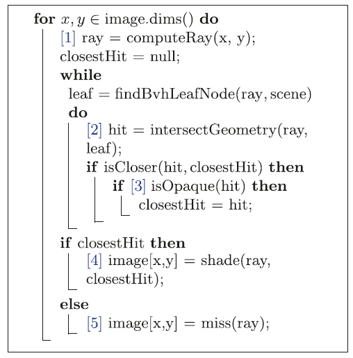

# 光线追踪精粹 笔记

原书来源：https://www.realtimerendering.com/raytracinggems/

## 一、光线追踪基础

#### **重要性采样**：

```
指使用不均匀分布的PDF（概率密度函数）采样来减少误差。
```

#### **准蒙特卡洛采样**：

```
使用数论方法的样本低差异模式代替传统的伪随机数生成器来创建随机样本的方法。
```

#### **光线的表示方式**：

P(t) = O + t**d**,其中O是空间中的一个点（光线射线的原点），**d**是光线的方向。一般**d**是归一化后的，这样t就是距离了。

**问**：t是距离带来什么好处？

答：这样可以用tmin和tmax表示光线前进的最近最远的值，方便光线停止。

DXR中的光鲜数据结构：

```
struct RayDesc {
    float3 origin;
    float3 Direction;
    float tmin;
    float tmax
}
```

#### **光线追踪器中的必要shader(DX12为例)**：


1. 光线生成着色器，启动整个管线，允许开发人员使用内置TraceRay来指定要启动哪些光线

2. 相交着色器，

3. 任意命中着色器，可以丢弃无用的相交（例如忽略透明的物体）

4. 最近命中着色器（主要是计算颜色）

5. 未命中着色器

   光线追踪的伪代码如下：



一般使用normal（法线分布函数决定下一个光线往哪里迭代）

#### **BLAS（底层加速结构）和TLAS（顶层加速结构）**

底层加速结构包括几何土元和程序化生成的图元。而TLAS包含一个或者多个BLAS，BLAS构建慢，但是求交快，TLAS构建快但是过度使用会影响性能。在动态场景中，如果只是节点包围盒发生了变化，refit就可以。但如果一直refit而不rebuild又会降低求交效率。所以要平衡refit和rebuild(rebuild慢)

DX12只需要输入VB和IB就可以调用接口直接构建加速结构，包括BLAS和TLAS

#### **着色器表**

着色器表是GPU内存中按照64位对齐的连续块，用来存储光追着色器数据和场景资源绑定。下面是其中一种布局方式。


在实际使用的过程当中，我们需要使用map来对shader table里面的内容赋值，包括不同着色器的identifier等，需要自己设置不同shader的offset。

#### **球幕相机**

第4章介绍的是一种特殊的camera，这种camera可以渲染全景（类似手机相机里面的全景拍照）和环形立体投影（类似VR的双眼）。这一章最重要的是如何根据屏幕像素点的位置计算半球面的仰角和方向角（如下图的屏幕空间）。具体方法是用弧度除以像素数，得到每像素弧度，然后再根据像素点到中心点（摄像机的位置）计算方向角，最后计算高度，从而得到光线的方向。

例如对于4096*4096分辨率的图片，球幕总弧度为180度（π），则每像素弧度是π/4096,那么I像素点的方向就是p = （I-M）\*π/4096,其中M是摄像机位置。


球幕相机还可以做左右眼的偏移，具体可以看该书的代码**。**

#### **避免自相交的快速可靠的方法**

本章给了一个问题“给定数组A，他由N个数字（Ai）组成，如何快速的查询数组任意区间内的最小值和最大值，例如第8个元素和第23个元素之间的最小值和最大值”。

这种方法在ray marching的时候会用到。


方法一：暴力法：预计算一个NxN的矩阵，每一个元素(i, j)表示第i个元素到第j个元素之间的最大值和最小值。这种方法的存储空间复杂度是o(N2)，查询复杂度是O(1)，修改复杂度是O(N2)

方法二：稀疏表查询法，是一种对暴力法的优化，他的想法是认为所有的序列（i-j)其实都是两个（2的整数倍长度）序列的并集，描述比较麻烦，可以看下图所示：L1是只存储长度为2的序列的最小值，L2只存储从该位置开始长度为4的最小值，以此类推，那么A2-A8总共7个数，相当于两个4个数序列的并集，即最后一张图的3和4，那么A2-A8的最小值就是3。这种方法的空间复杂度是O（NlogN），查询复杂度是O（1），修改复杂度是O(logN)


方法三：区间树递归查询法。区间树如下所示，每个节点存储所有子节点的最大值和最小值和对应的index范围。查询的时候需要递归的向下查询，本方法的空间复杂度是O(N),查询的复杂度是O(logN)，修改的复杂度也是O(N)


方法四：区间树迭代查询法，这是一组二叉树：


其查询伪代码为：

本质就是左边如果是奇数，右边index如果是偶数，那么就直接merge到result上面（因为这两个地方再往上一个level就包含了另一个数了）。

该方法的时间和空间复杂度都和递归法相同，但是因为不需要递归，常数节省非常多，所以效率很高。是最常用的方法。


## 二、相交和效率

#### **避免自相交的快速可靠的方法**

**传统方法**：使用光线命中距离代入光线方程（当光线传输距离过长时，这种方法会因为精度误差问题导致交点不在平面上，不利于解决自相交问题（添加bias))

**采用质心坐标的参数化方法**：用光线方程和三角形相交时点的质心坐标来表示相交点，因为质心坐标也有精度问题，导致算出的交点可能不在原光线上，但是仍然在相交平面上，在解决自相交问题时会好一点。

**避免自相交**：即使把新光线的起点“精确”放到表面上，仍然会产生自相交，因为起点到表面的距离可能不是0，下面是一些常用方法：

1. 图片ID排除法：显式的排除以橡胶的图元，问题在于如果交点在共同的边上，或者新光线和表面夹角比较小，仍然会自相交；（2，无法处理重复或者重叠的几何体。（3，只适合平面的图元。如果图片不是平面的，则可能会产生有效的自相交。
2. 限制光线区间：设置光线相交距离的最小值ε > 0,这种方法需要根据不同场景调整ε 的值，不够可靠和通用。也会出现小夹角下（距离足够长）时的自相交，或者错过了一个临近的表面的有效交点（例如交点旁边有个垂直的面）如下图所示。


3. 沿着色法向量或者原光线方向偏移，和方法2的问题类似。而且因为插值和法线贴图的原因，着色法向量可能不垂直于表面。

4. 沿几何法向量做自适应的偏移。这个方法是书中推荐的方法，他认为误差的大小和交点距离原点（0,0,0）的距离成正比，距离越远，误差越大，ε 应该根据这个距离动态调整。该算法实际上是设置了一个阈值origin(),比这个阈值小的距离则直接加上normal的偏移，比这个阈值大的距离，则转换到整数空间做偏移后再转换到浮点数，以减小不同距离下的浮点数误差。如下所示


#### 光线和球体相交检测的精度提升

**光线球体相交的通用解法**：设光线为R(t) = O + td,球的方程为(P-G)*(P-G) = r\*r,（其中G是球体的中心点），直接代入公式可以判断是否有交点以及交点位置P0。并且能够知道在交点处的单位法向量是（P0-G）/r。

因为浮点误差，这种方法在球距离光源很远的时候会出现问题，如下图所示,从左到右是单位球距离相机100,2000,4100和8000时的效果。


同样因为浮点误差，在光线靠近一个巨大的球体时，也会出现问题，如下图所示：


**为什么会出现浮点误差**：浮点数是s*pow(2, e)的表示形式，当加减法时，会把s和e做对齐，较小的浮点数尾数就会被右移，这样精度就会降低。这种问题在计算c = f\*f - r\*r时很明显例如（b\*b-4\*a\*c),平方后导致可用精度减半，再相减就会以更小的精度为保留。


**更好的解法**：书中给了一个更好的解法，如上图所示，f = O-G。这种方法的基本思想是做点乘之前前先做减法。

**巨量消失**：当两个非常接近的浮点数做减法时，会保留非常小量的有效位数。当光线和一个巨大球体的交点落在光线起点附近时就会出现这种情况。（b ≈ pow(b, 2) - 4ac时）

**解决巨量消失的方法**：利用二次方程两个解t0\*t1 = c/a,使用以下方程求解其中一个解，避免两个相近的数相减(让b翻倍)：


#### 计算光线和双线性曲面相交的几何方法

**双线性曲面**：是支持但不计算光线相交的最简单的曲面，其定义如下图所示：


这种双线性曲面其实是有四个控制点，这可以看成是一个四边形，或者是用两个三角形来表示。而如果想要把三角形网格转换成参数曲面网格，则需要有一种专门的方法做这个事情。

可以把三角形看成退化的四边形，这样就可以用(1-u)(1-v), u, (1-u)v来表示三角形了。

**GARP**：这个方法是一种把三角形组装成四边形后求交的方法。他把四边形组成的3维曲面，通过和光线求公式，得到一个或者两个（参数化曲面可能有自重叠的情况）解，每一个解都用uv和t来表示。该方法需要较好的数学基础和3维空间的想象能力，在求叉乘和abc的时候有些没搞明白,代码如下：


#### DXR中的多重命中光线追踪

**多重命中**：指的是在命中一个面以后光线继续前进，一根光线命中多个面并返回多个面的信息的情况，通常用来模拟弹道穿透、射频广播等领域。多重命中仍然需要高效进行。

**多重命中的暴力遍历法**：暴力遍历就是按照正常情况，在anyhitshader里面ignorehit持续遍历，并且记录下来经过的相交点的信息（包括漫反射颜色、距离和法线等），这种方法比较灵活，但是比较慢，每一次相交基本都要遍历所有的BVH节点。

**节点剔除多重命中BVH遍历**：其实就是当已经收集了N >= Nquery的时候，判断当前交点是否比已知的最远节点还要远，如果还要远，则直接剔除掉。如果，如下所示：


实验数据显示，anyhit shader和intersection shader实现暴力和节点剔除的效率完全不同，这是为什么？？？？？？？

答：书最后给了解释，认为在相交着色器中有很多“区间更新”的操作，会做更频繁的剔除工作，这个工作比节省的开销还要大。