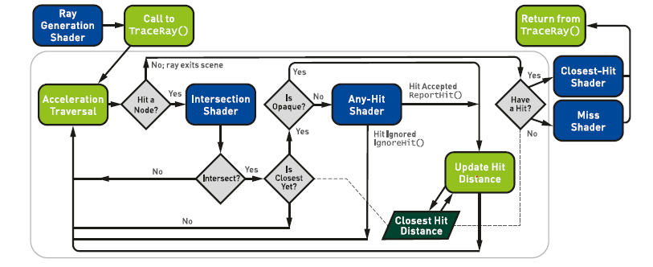

# 光线追踪精粹 笔记

原书来源：https://www.realtimerendering.com/raytracinggems/

### 一、光线追踪基础

**重要性采样**：

```
指使用不均匀分布的PDF（概率密度函数）采样来减少误差。
```

**准蒙特卡洛采样**：

```
使用数论方法的样本低差异模式代替传统的伪随机数生成器来创建随机样本的方法。
```

**光线的表示方式**：

P(t) = O + t**d**,其中O是空间中的一个点（光线射线的原点），**d**是光线的方向。一般**d**是归一化后的，这样t就是距离了。

**问**：t是距离带来什么好处？

答：这样可以用tmin和tmax表示光线前进的最近最远的值，方便光线停止。

DXR中的光鲜数据结构：

```
struct RayDesc {
    float3 origin;
    float3 Direction;
    float tmin;
    float tmax
}
```

**光线追踪器中的必要shader(DX12为例)**：



1. 光线生成着色器，启动整个管线，允许开发人员使用内置TraceRay来指定要启动哪些光线

2. 相交着色器，

3. 任意命中着色器，可以丢弃无用的相交（例如忽略透明的物体）

4. 最近命中着色器（主要是计算颜色）

5. 未命中着色器

   光线追踪的伪代码如下：


一般使用normal（法线分布函数决定下一个光线往哪里迭代）

**BLAS（底层加速结构）和TLAS（顶层加速结构）**

底层加速结构包括几何土元和程序化生成的图元。而TLAS包含一个或者多个BLAS，BLAS构建慢，但是求交快，TLAS构建快但是过度使用会影响性能。在动态场景中，如果只是节点包围盒发生了变化，refit就可以。但如果一直refit而不rebuild又会降低求交效率。所以要平衡refit和rebuild(rebuild慢)

DX12只需要输入VB和IB就可以调用接口直接构建加速结构，包括BLAS和TLAS

**着色器表**

着色器表是GPU内存中按照64位对齐的连续块，用来存储光追着色器数据和场景资源绑定。下面是其中一种布局方式。


在实际使用的过程当中，我们需要使用map来对shader table里面的内容赋值，包括不同着色器的identifier等，需要自己设置不同shader的offset。

**球幕相机**

第4章介绍的是一种特殊的camera，这种camera可以渲染全景（类似手机相机里面的全景拍照）和环形立体投影（类似VR的双眼）。这一章最重要的是如何根据屏幕像素点的位置计算半球面的仰角和方向角（如下图的屏幕空间）。具体方法是用弧度除以像素数，得到每像素弧度，然后再根据像素点到中心点（摄像机的位置）计算方向角，最后计算高度，从而得到光线的方向。

例如对于4096*4096分辨率的图片，球幕总弧度为180度（π），则每像素弧度是π/4096,那么I像素点的方向就是p = （I-M）\*π/4096,其中M是摄像机位置。


球幕相机还可以做左右眼的偏移，具体可以看该书的代码**。**

**计算子数组的最大值和最小值**

本章给了一个问题“给定数组A，他由N个数字（Ai）组成，如何快速的查询数组任意区间内的最小值和最大值，例如第8个元素和第23个元素之间的最小值和最大值”。

这种方法在ray marching的时候会用到。


方法一：暴力法：预计算一个NxN的矩阵，每一个元素(i, j)表示第i个元素到第j个元素之间的最大值和最小值。这种方法的存储空间复杂度是o(N2)，查询复杂度是O(1)，修改复杂度是O(N2)

方法二：稀疏表查询法，是一种对暴力法的优化，他的想法是认为所有的序列（i-j)其实都是两个（2的整数倍长度）序列的并集，描述比较麻烦，可以看下图所示：L1是只存储长度为2的序列的最小值，L2只存储从该位置开始长度为4的最小值，以此类推，那么A2-A8总共7个数，相当于两个4个数序列的并集，即最后一张图的3和4，那么A2-A8的最小值就是3。这种方法的空间复杂度是O（NlogN），查询复杂度是O（1），修改复杂度是O(logN)


方法三：区间树递归查询法。区间树如下所示，每个节点存储所有子节点的最大值和最小值和对应的index范围。查询的时候需要递归的向下查询，本方法的空间复杂度是O(N),查询的复杂度是O(logN)，修改的复杂度也是O(N)


方法四：区间树迭代查询法，这是一组二叉树：


其查询伪代码为：

该方法的时间和空间复杂度都和递归法相同，但是因为不需要递归，常数节省非常多，所以效率很高。是最常用的方法。