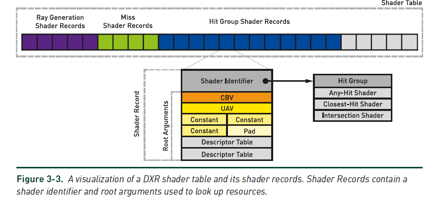
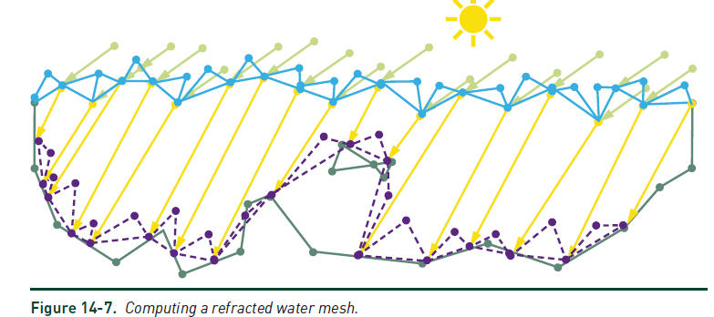

# 光线追踪精粹 笔记

原书来源：https://www.realtimerendering.com/raytracinggems/

## 一、光线追踪基础

#### **重要性采样**：

```
指使用不均匀分布的PDF（概率密度函数）采样来减少误差。
```

#### **准蒙特卡洛采样**：

```
使用数论方法的样本低差异模式代替传统的伪随机数生成器来创建随机样本的方法。
```

#### **光线的表示方式**：

P(t) = O + t**d**,其中O是空间中的一个点（光线射线的原点），**d**是光线的方向。一般**d**是归一化后的，这样t就是距离了。

**问**：t是距离带来什么好处？

答：这样可以用tmin和tmax表示光线前进的最近最远的值，方便光线停止。

DXR中的光鲜数据结构：

```
struct RayDesc {
    float3 origin;
    float3 Direction;
    float tmin;
    float tmax
}
```

#### **光线追踪器中的必要shader(DX12为例)**：


1. 光线生成着色器，启动整个管线，允许开发人员使用内置TraceRay来指定要启动哪些光线

2. 相交着色器，

3. 任意命中着色器，可以丢弃无用的相交（例如忽略透明的物体）

4. 最近命中着色器（主要是计算颜色）

5. 未命中着色器

   光线追踪的伪代码如下：


一般使用normal（法线分布函数决定下一个光线往哪里迭代）

#### **BLAS（底层加速结构）和TLAS（顶层加速结构）**

底层加速结构包括几何土元和程序化生成的图元。而TLAS包含一个或者多个BLAS，BLAS构建慢，但是求交快，TLAS构建快但是过度使用会影响性能。在动态场景中，如果只是节点包围盒发生了变化，refit就可以。但如果一直refit而不rebuild又会降低求交效率。所以要平衡refit和rebuild(rebuild慢)

DX12只需要输入VB和IB就可以调用接口直接构建加速结构，包括BLAS和TLAS

#### **着色器表**

着色器表是GPU内存中按照64位对齐的连续块，用来存储光追着色器数据和场景资源绑定。下面是其中一种布局方式。



在实际使用的过程当中，我们需要使用map来对shader table里面的内容赋值，包括不同着色器的identifier等，需要自己设置不同shader的offset。

#### **球幕相机**

第4章介绍的是一种特殊的camera，这种camera可以渲染全景（类似手机相机里面的全景拍照）和环形立体投影（类似VR的双眼）。这一章最重要的是如何根据屏幕像素点的位置计算半球面的仰角和方向角（如下图的屏幕空间）。具体方法是用弧度除以像素数，得到每像素弧度，然后再根据像素点到中心点（摄像机的位置）计算方向角，最后计算高度，从而得到光线的方向。

例如对于4096*4096分辨率的图片，球幕总弧度为180度（π），则每像素弧度是π/4096,那么I像素点的方向就是p = （I-M）\*π/4096,其中M是摄像机位置。


球幕相机还可以做左右眼的偏移，具体可以看该书的代码**。**

#### **避免自相交的快速可靠的方法**

本章给了一个问题“给定数组A，他由N个数字（Ai）组成，如何快速的查询数组任意区间内的最小值和最大值，例如第8个元素和第23个元素之间的最小值和最大值”。

这种方法在ray marching的时候会用到。


方法一：暴力法：预计算一个NxN的矩阵，每一个元素(i, j)表示第i个元素到第j个元素之间的最大值和最小值。这种方法的存储空间复杂度是o(N2)，查询复杂度是O(1)，修改复杂度是O(N2)

方法二：稀疏表查询法，是一种对暴力法的优化，他的想法是认为所有的序列（i-j)其实都是两个（2的整数倍长度）序列的并集，描述比较麻烦，可以看下图所示：L1是只存储长度为2的序列的最小值，L2只存储从该位置开始长度为4的最小值，以此类推，那么A2-A8总共7个数，相当于两个4个数序列的并集，即最后一张图的3和4，那么A2-A8的最小值就是3。这种方法的空间复杂度是O（NlogN），查询复杂度是O（1），修改复杂度是O(logN)


方法三：区间树递归查询法。区间树如下所示，每个节点存储所有子节点的最大值和最小值和对应的index范围。查询的时候需要递归的向下查询，本方法的空间复杂度是O(N),查询的复杂度是O(logN)，修改的复杂度也是O(N)


方法四：区间树迭代查询法，这是一组二叉树：


其查询伪代码为：

本质就是左边如果是奇数，右边index如果是偶数，那么就直接merge到result上面（因为这两个地方再往上一个level就包含了另一个数了）。

该方法的时间和空间复杂度都和递归法相同，但是因为不需要递归，常数节省非常多，所以效率很高。是最常用的方法。


## 二、相交和效率

#### **避免自相交的快速可靠的方法**

**传统方法**：使用光线命中距离代入光线方程（当光线传输距离过长时，这种方法会因为精度误差问题导致交点不在平面上，不利于解决自相交问题（添加bias))

**采用质心坐标的参数化方法**：用光线方程和三角形相交时点的质心坐标来表示相交点，因为质心坐标也有精度问题，导致算出的交点可能不在原光线上，但是仍然在相交平面上，在解决自相交问题时会好一点。

**避免自相交**：即使把新光线的起点“精确”放到表面上，仍然会产生自相交，因为起点到表面的距离可能不是0，下面是一些常用方法：

1. 图片ID排除法：显式的排除以橡胶的图元，问题在于如果交点在共同的边上，或者新光线和表面夹角比较小，仍然会自相交；（2，无法处理重复或者重叠的几何体。（3，只适合平面的图元。如果图片不是平面的，则可能会产生有效的自相交。
2. 限制光线区间：设置光线相交距离的最小值ε > 0,这种方法需要根据不同场景调整ε 的值，不够可靠和通用。也会出现小夹角下（距离足够长）时的自相交，或者错过了一个临近的表面的有效交点（例如交点旁边有个垂直的面）如下图所示。


3. 沿着色法向量或者原光线方向偏移，和方法2的问题类似。而且因为插值和法线贴图的原因，着色法向量可能不垂直于表面。

4. 沿几何法向量做自适应的偏移。这个方法是书中推荐的方法，他认为误差的大小和交点距离原点（0,0,0）的距离成正比，距离越远，误差越大，ε 应该根据这个距离动态调整。该算法实际上是设置了一个阈值origin(),比这个阈值小的距离则直接加上normal的偏移，比这个阈值大的距离，则转换到整数空间做偏移后再转换到浮点数，以减小不同距离下的浮点数误差。如下所示


#### 光线和球体相交检测的精度提升

**光线球体相交的通用解法**：设光线为R(t) = O + td,球的方程为(P-G)*(P-G) = r\*r,（其中G是球体的中心点），直接代入公式可以判断是否有交点以及交点位置P0。并且能够知道在交点处的单位法向量是（P0-G）/r。

因为浮点误差，这种方法在球距离光源很远的时候会出现问题，如下图所示,从左到右是单位球距离相机100,2000,4100和8000时的效果。


同样因为浮点误差，在光线靠近一个巨大的球体时，也会出现问题，如下图所示：


**为什么会出现浮点误差**：浮点数是s*pow(2, e)的表示形式，当加减法时，会把s和e做对齐，较小的浮点数尾数就会被右移，这样精度就会降低。这种问题在计算c = f\*f - r\*r时很明显例如（b\*b-4\*a\*c),平方后导致可用精度减半，再相减就会以更小的精度为保留。


**更好的解法**：书中给了一个更好的解法，如上图所示，f = O-G。这种方法的基本思想是做点乘之前前先做减法。

**巨量消失**：当两个非常接近的浮点数做减法时，会保留非常小量的有效位数。当光线和一个巨大球体的交点落在光线起点附近时就会出现这种情况。（b ≈ pow(b, 2) - 4ac时）

**解决巨量消失的方法**：利用二次方程两个解t0\*t1 = c/a,使用以下方程求解其中一个解，避免两个相近的数相减(让b翻倍)：


#### 计算光线和双线性曲面相交的几何方法

**双线性曲面**：是支持但不计算光线相交的最简单的曲面，其定义如下图所示：


这种双线性曲面其实是有四个控制点，这可以看成是一个四边形，或者是用两个三角形来表示。而如果想要把三角形网格转换成参数曲面网格，则需要有一种专门的方法做这个事情。

可以把三角形看成退化的四边形，这样就可以用(1-u)(1-v), u, (1-u)v来表示三角形了。

**GARP**：这个方法是一种把三角形组装成四边形后求交的方法。他把四边形组成的3维曲面，通过和光线求公式，得到一个或者两个（参数化曲面可能有自重叠的情况）解，每一个解都用uv和t来表示。该方法需要较好的数学基础和3维空间的想象能力，在求叉乘和abc的时候有些没搞明白,代码如下：


#### DXR中的多重命中光线追踪

**多重命中**：指的是在命中一个面以后光线继续前进，一根光线命中多个面并返回多个面的信息的情况，通常用来模拟弹道穿透、射频广播等领域。多重命中仍然需要高效进行。

**多重命中的暴力遍历法**：暴力遍历就是按照正常情况，在anyhitshader里面ignorehit持续遍历，并且记录下来经过的相交点的信息（包括漫反射颜色、距离和法线等），这种方法比较灵活，但是比较慢，每一次相交基本都要遍历所有的BVH节点。

**节点剔除多重命中BVH遍历**：其实就是当已经收集了N >= Nquery的时候，判断当前交点是否比已知的最远节点还要远，如果还要远，则直接剔除掉。如果，如下所示：


实验数据显示，anyhit shader和intersection shader实现暴力和节点剔除的效率完全不同，这是为什么？？？？？？？

答：书最后给了解释，认为在相交着色器中有很多“区间更新”的操作，会做更频繁的剔除工作，这个工作比节省的开销还要大。

#### 一种具有高扩展效率的简单负载均衡方案

简单来说就是把大量像素均匀的分配给各个处理单元。

一个简单的例子：一根光线直接打到环境球上，另一根光线在汽车的前灯处反复反弹，这两根光线产生的开销就完全不同。且这种开销无法预知。 负载均衡应该适时的考虑不同CPU或者GPU计算单元的计算能力，给计算能力强的单元更多的任务。

**简单分块**的负载均衡方法：如果有4个CPU，那么把整块图像均匀的分成四块是比较简单的方法，这种方法的缺点在于可能某一块的场景十分复杂，计算比较慢。其他三块都在等他

**按任务大小**的负载均衡方法：把简单分块的块分的足够小（每个像素），这种方法对缓存不太友好。

按**Task Distribution**的方法：n个像素的图像被划分成m个区域，，每个区域有s个像素，，且m是2的幂次m = pow(2, b)，m需要保证每个区域都至少有s个像素（例如128）且m越大越好。假设处理器有P个，那么{0,1,2，...，m-1}个区域应该被划分成p个连续的区间。区间的长度应正比于处理器的相对性能。最后把每个区域都做一个重映射（例如把每个下标的最低b比特位左右反转）从而是使区域均匀分布。代码如下所示：


因为“例如把每个下标的最低b比特位左右反转”这个方法自己是自己的逆函数，所以想要重新找到绘制块然后将所有的块组装起来也是很简单的,如下图所示。


## 三、反射、折射和阴影

#### **自动处理相邻Volumes的材质**

当两个不同材质的物体相邻时，会出现材质相邻的情况（例如装着水的水杯，水杯和水是不同的材质，也是不同的mesh）在光追的时候，这两个mesh 的关系影响到最终的效果。可以把两个mesh中间留一些缝隙，也可以让两个mesh 稍微重叠一点（这个时候需要设置不同mesh材质的优先级），（但是不能合并两个mesh，因为合并两个mesh会让一个mesh有不同的材质）。这一章就讲了如何处理这种问题

**处理相邻材质的算法：**维护一个栈，这个栈上表示光线进入材质的材质index，当光线进入一个新的材质，就push进去新材质的index，当光线逃出一个材质时，就把逃出材质的index pop出来。材质被引用的奇偶性表示是否在某个材质内部。这有下面三种情况：

1. 对于反射，需要 pop top元素
2. 对于折射，pop top元素以后还需要删除以前对该材质的引用
3. 对于相同的材质边界，保持堆栈不便。
4. 如果相机本身就在一个介质内，则初始情况就要有一个初始堆栈。
5. 下面是代码


#### 基于微表面阴影函数来解决凹凸贴图中的阴影边界问题

在使用凹凸贴图时，因为对法线的扰动会导致出现阴影硬边，这篇文章就是解决这个问题的。

阴影硬边出现的原因在于凹凸贴图对法线的扰动是不均匀的：


这篇文章主要的贡献在于，对于这种被扰动的法线，他会使用GGX法线分布函数对这个扰动做修正，从而达到平滑的效果。在他的方法里面，最重要的两个公式分别为,G1就是阴影因子（当前法线阴影项的合理概率），αggx则是GGX金丝来的粗糙度，根据这两个值，文章给了代码的实现：θi是入射光方向和真实表面法线的夹角，θd是表面法线和凹凸发现的夹角。


#### 13.光线追踪实时阴影

光线追踪相比较shadow map的优势：

1. 避免了因为shadow map分辨率不足导致的锯齿状阴影
2. 避免了peter panning
3. 可以处理半影（软阴影）
4. 可以对半透明物体产生的阴影做处理。

本文的一些加速方法：

1. 只对半影区域做密集采样，对完全阴影和完全光照的地方做稀疏采样。文章中存储前四帧所有光源的可见性到一个四通道纹理中，一个通道存储一帧所有光源的可见性，半影通常发生在可见性发生变化的区域，（在这些区域需要做密集采样）。除此以外，文章还使用了一个5x5的最大值滤波器和一个13x13的低通滤波器，最大值滤波器保证周围的像素点也会受到一个超大变化量的影响（一个超大变化量会影响多个像素），而低通滤波器则可以防止快速运动时的闪烁
2. 时域采样复用，使用reprojection技术，
3. 如何增加或减少采样数量：如果可见性变化大于一个阈值，S = min(Smax, S+1)如果可见性小于一个阈值，且前四帧的采样数恒定，S = max(0, S-1).对于reprojection失败的像素，直接按照Smax做采样，当屏幕上大部分像素都重投影失败时，为了防止性能下降，可以将Smax的值降低。
4. 采样mask：当采样数降到0时，表示这个像素一直没有变化，可以直接复用之前的shading结果，单这样可能会发生误差累积，所以文中的策略是把屏幕分成多个4x4的块，每次要强制更新这4x4pixel里面的像素，把2x2=4和块看成一组，四帧里面每组更新其中一个块，如下所示：

5. 计算可见性：空间滤波+时间滤波，类似SVGF的方式。最后输出的是降噪后的全图的可见性buffer，最后则会根据这个可见性buffer来做阴影着色。
6. 在计算灯光的可见性之前会先做light culling，把过远的灯光都cull掉。

#### 14.用DXR实现的Ray-Guided的单散射介质体积水焦散

**焦散的传统绘制方式**：首先确定水面的position和normal，从光源处绘制一个水表面的pos和normal的图，这个叫做焦散图。从这些位置出发，一部分光线发生折射并且和水下的纹理相交，相交的位置存储在折射焦散图里面，一部分光线发生反射，和墙壁等水上场景相交，相交的结果存储在反射焦散图里面。这些焦散图在后面体积光切片时会被用到。

**与场景求交的方法**（base）：

1. 对shadow map和depth buffer做raymarching，来找到交点，但是可能会有一部分场景同时被shadow map和depth buffer挡住

2. 对shadow map和depth buffer做多layer，在多个视角做shadow map和depth buffer，从而产生多张图，这种方法复杂度很高，代价也很高。

3. 把水下场景体素化，对体素做raymarching。但是这样做非常慢。

   **本文的方法**（使用DXR）：

   下图公式描述了从眼睛E向右看时，射入眼睛里的辐照度公式。

   其中P是射向E的线的中点，Ω是所有折射进来的光线，

   τ : 是水体积的消光系数，

   l(ω)+|P-E| :光线到达P点之前沿着水下传播的消光，P-E是P点到E点的长度（消光（or吸光），值的是光强度发生了衰减）

    σs(P)：点P出的散射系数

   p(E − P, ω)：相位函数，决定了有多少从折射光方向散射到P点

   Lin : 沿折射光方向照射到P点处的辐照度

   v : 沿折射光方向的可见度，例如折射光线是否到达了P点？有两种可能的近似方案来对所有的散射事件做积分计算：

   1. 使用3D grid去累积每个网格中心的离散值，这里需要使用足够高的分辨率防止漏光。
   
      （1）.水面上的点到场景交点需要有足够多的光线，对于每一个到达grid cell的折射光线，计算距离grid cell中心最近的点P
   
      （2）计算从P点到达眼睛的相位函数和透射辐照度
   
      （3）对网格单元中透射的辐照度进行离散积分。
   
   2. 创建一个足够密集的三角形光束体，来近似使用渲染管线和additive blending计算的散射积分。下一章提供了一个避免三角形和水面三角形因折射光线方向的快速变化产生非凸包的情况。
   
   
   
   

**计算光束压缩比**：所谓三角形凸包，其实就是水面三角形和水底下折射三角形（每个水面三角形发出的折射光线和水底相交）形成的几何体，如图所示：



这两个三角形会形成一个光束压缩比，计算方式为，水面三角形面积除以水底三角形面积，这个压缩比用来描述三角形光束形成非凸体积的可能性，或者控制把每个凸包细分为更小光束的密度。

**渲染焦散图**：将所有水面三角形用PS写到两个texture上，一个是water surface的3D position，另一个是这个water surface的surface normal

**光线追踪折射焦散图和累积表面焦散**：使用DXR对上一步得到的焦散图中的有效像素做光线追踪，与场景的交点存到折射焦散图里面，此外交点位置会被变换到screenspace，并且会被用来累积表面焦散散射。

1. 对于焦散图中每个pixel做trace

2. 计算光线和水下场景几何体的交点，有些情况下可以把这个光线cull掉，例如一个shadow map test发现这个光线被水表面上方的某个几何体遮挡住的时候。

3. 将交点的位置写到折射焦散图中。

4. 可选，沿着折射光线与场景交点的反射方向二次trace一个光线，并且把交点存到一个反弹的焦散图中

5. 在一个offscreen buffer里面对焦散做累加（离散积分）。其步骤是，把交点转换到screenspace上，并且用InterlockedAdd在该屏幕位置做累积。累积的辐照度值可以用之前的压缩比来做缩放，也可以根据距离和吸光系数来做缩放。

**自适应水表面三角形的曲面细分**：这一个步骤主要是为了

1. 防止三角形光束变成非凸包

2. 尽量接近散射积分的理想结果而提供足够多的slice

3. 确保没有体积光穿透场景中的小物体而造成漏光

   曲面细分和非凸包如下所示：

   


**构建三角形光束体**：

使用geometry shader 对经过曲面细分的三角形构建三角形光束体对应的triangulated  hull

1. 把输入顶点映射到焦散图或者折射焦散图空间

2. 从焦散图中读取光束顶部三角形的position

3. 从焦散图中读取光束底部三角形的position

4. 构建八个三角形。

5. 计算每个输出顶点处的三角形光束的估计厚度，这样厚度就会通过插值传递给VS

6. 计算每个输出顶点的光线方向。

**使用 addivice  blending渲染体积焦散**

使用PS做additive blending，根据当前3D position和茶之后的光线方向，计算相位函数（phase function），把散射项乘以插值后的厚度。

**结合表面焦散和体积焦散**

1. 对表面焦散做降噪和模糊

2. 用降噪后的表面焦散照亮场景，例如乘上GBuffer中的albedo

3. 对体积焦散结果做模糊并把它添加到经过了光照的GBuffer，从而实现两个焦散的结合。

   整个步骤如下所示

   


## 四、采样

#### 重要性采样

