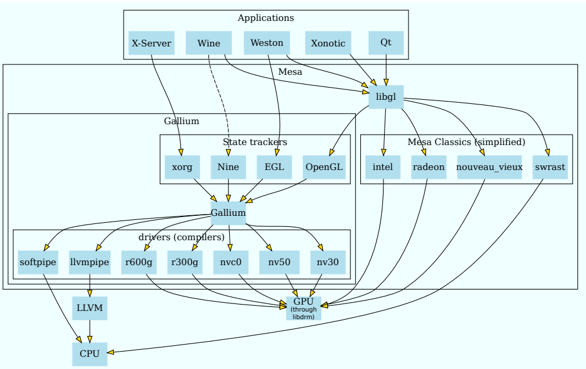
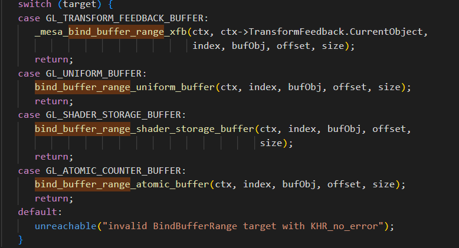
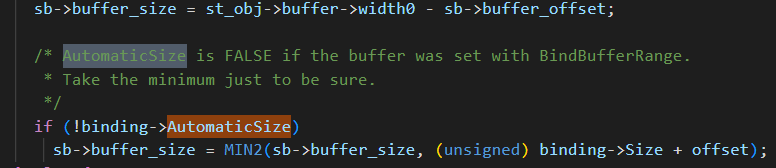
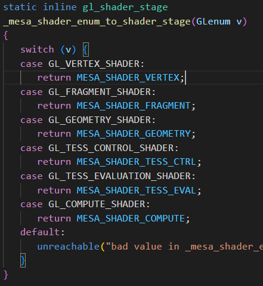
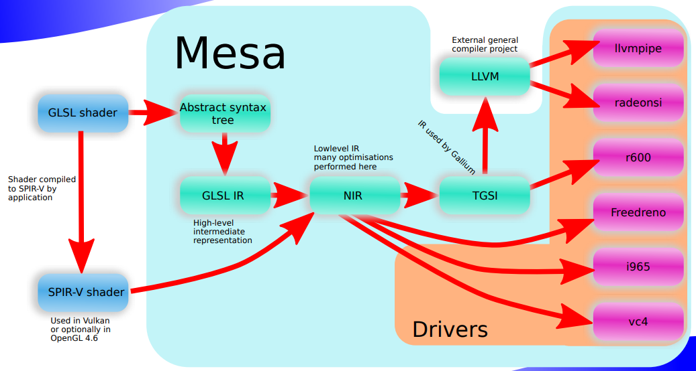

关于mesa架构方面，[这篇文章讲的比较清楚](https://blog.csdn.net/HaoBBNuanMM/article/details/109054106)，[还有这个](https://zhuanlan.zhihu.com/p/398226773)，[还有这个](http://joyxu.github.io/2021/05/13/gpu05/)

关于mesa的代码结构方面，[这篇文章讲的比较清楚](https://winddoing.github.io/post/39ae47e2.html)

mesa的官网下载地址：https://archive.mesa3d.org/

后续做源码剖析会根据opengl和vulkan不同API类别分别做剖析

opengl重点文件：.\src\mesa\main,    .\src\mesa\state_tracker,会涉及到一些,\src\gallium



**经典流程：**

```
mesa/main下面文件:  _mesa_BufferData —— _mesa_buffer_data —— _buffer_data —— pipe->buffer_subdata

gallium/drivers下面文件：
r600_buffer_subdata（以Amd r600为例）/ i915_buffer_subdata（以intel i915为例）—— memcpy
```

# opengl-mesa实现

所有的入口函数都是_mesa_xxxx,例如_mesa_BindBuffer、_mesa_BindBufferRange等。

当前进度23/136

### buffer（共15个接口）

buffer入口 src\main\mesa\bufferobj

gallium的r600(AMD驱动接口)对应gallium/drivers/r600/r600_blit.c和gallium/drivers/r600/r600_buffer_common.c

##### glGenBuffers和glCreateBuffers

注意这两个接口类似，但是他们的作用不太一样，他们都会调用create_buffers里面，这时会有一个dsa的标记，glCreateBuffers（dsa=true）会直接创建一个新的buffer，而glGenBuffers（dsa=false）则会创建一个虚假的buffer，把buffer创建延迟到glbindbuffer或者bufferdata（真正使用）的时候。然后调用new_gl_buffer_object申请一块新的buffer。

**流程：**添加锁——释放僵尸buffer——通过hash找到bufferid——调用new_gl_buffer_object——_mesa_bufferobj_alloc申请buffer——释放锁

##### glBindBuffer

入口函数_mesa_BindBuffer，调用到bind_buffer_object，

**流程：**查找当前绑定buffer是否重复绑定 —— 查找当前需要绑定的buffer —— 如果是虚假buffer则需要申请新buffer——调用_mesa_reference_buffer_object_做buffer指针赋值。切换到新buffer上

##### glBindBufferRange

入口函数_mesa_BindBufferRange——bind_buffer_range，该函数是把指定的buffer范围绑定到指定的GPU index上。

他会根据target的不同，通过switch到别的接口，如下所示：



**流程：**_mesa_BindBufferRange——bind_buffer_range——\_mesa_reference_buffer_object(主要是把当前的buffer绑定到ctx上的uniformbuffer上) —— bind_uniform_buffer——bind_buffer（主要是把buffer绑定到ctx->UniformBufferBindings[index]上面，其实就是下面这段代码：

```
_mesa_reference_buffer_object(ctx, &binding->BufferObject, bufObj);
binding->Offset = offset;
binding->Size = size;
binding->AutomaticSize = autoSize;
```

##### glBindBufferBase

和glbindbufferrange类似，只不过bindbufferbase的接口少了offset和buffersize。里面的实现一样。但有一点不同，就是他传入offset和size的时候会传入一个AutomaticSize的flag，表示后面再获取size。在真正使用的时候，会默认使用当时的buffersize，只有AutomaticSize为false时，才会使用bindbufferrange的size。如下所示：



**流程：**_mesa_BindBufferBase——bind_buffer_base_uniform_buffer——\_mesa_reference_buffer_object(主要是把当前的buffer绑定到ctx上的uniformbuffer上) —— bind_uniform_buffer——bind_buffer

##### glBindBuffersBase和glBindBuffersRange

预留接口，在ARB_multi_bind扩展中使用，实现的时候就是比glBindBufferBase/glBindBufferRange多一个for循环

##### glBufferData 和glBufferSubData

**流程：**_mesa_BufferData —— get_buffer（获取当前buffer）—— _mesa_buffer_data——\_ buffer_data——\_mesa_buffer_unmap_all_mappings(把所有已经map的buffer都unmap掉，因为现在要写入数据了)——\_mesa_bufferobj_data——bufferobj_data——pipe->buffer_subdata（gallium）——r600_buffer_subdata（以Amd r600为例）/ i915_buffer_subdata（以intel i915为例）—— memcpy

##### glClearBufferSubData 和glClearBufferData

如果没有硬件驱动实现，则会退化成软件实现，软件实现就是使用memcpy把clearvalue复制到dest上面。虽然硬件感觉也差不多。。

**流程：** _mesa_ClearBufferSubData —— clear_buffer_sub_data —— clear_buffer_subdata_sw / pipe->r600_clear_buffer —— 硬件dma支持，或者走memcpy流程。

##### glMapBufferRange和glMapBuffer

首先要getbuffer，然后把pointer、length、offset和access都存进去。

这里会有一些防呆设计，比如对调用者没有调用对时的修改。。map是会对每一个index存一套offset、length和access的。map出来的pointer也是通过pipe驱动获得。

glMapBuffer也是走的glMapBufferRange的流程。

**流程：**_mesa_MapBufferRange —— map_buffer_range —— _mesa_bufferobj_map_range——r600_buffer_map_sync_with_rings —— radeon_winsys里面的buffer_map（这个是闭源的，可以参考纯软的kms_dri_sw_winsys.c）

##### glUnmapBuffer

unmap就是把gl_buffer_object里面的内容全部置为空，然后调用驱动的buffer_unmap

##### glInvalidateBufferSubData和glInvalidateBufferData

也是首先使用lookup_bufferobj查找到buffer，然后调用bufferobj_invalidate。注意如果这个buffer已经被map了，是无法做invalidate操作的。

这两个会调用到r600_invalidate_resource，AMD的驱动会reallocate buffer并且更新所有资源的binding。

glInvalidateBufferData走的也是glInvalidateBufferSubData的路子

##### glCopyBufferSubData

首先getbuffer，然后调用bufferobj_copy_subdata，当前的buffer是不能被map的，如果被map会发生崩溃。

然后调用驱动的resource_copy_region，将一块pixel从一个res拷贝到另一个，这两个res必须是同样的格式。

然后会调用到r600_resource_copy_region里面，也会检查能否使用dma，如果不行的话就会fallback到r600_resource_copy_region里面，使用memcpy和buffer_map/texture_map来拷贝buffer。

### shader（共22个接口）

shader入口 src\main\mesa\shaderapi.c

##### glcreateshader

createshader之前需要添加锁，然后需要确认当前shader的stage，opengl的shader stage如下所示：



然后会创建一个新的shader，关键代码只有几行，很简单：

```c++
struct gl_shader *shader;
shader = rzalloc(NULL, struct gl_shader);
if (shader) {
    shader->Stage = stage;
    shader->Name = name;
    shader->RefCount = 1;
    shader->info.Geom.VerticesOut = -1;
    shader->info.Geom.InputType = SHADER_PRIM_TRIANGLES;
    shader->info.Geom.OutputType = SHADER_PRIM_TRIANGLE_STRIP;
}  
```

##### glshadersource和glshadersourceARB

这个接口的入口函数是\_mesa_ShaderSource

首先会去找需要shadersource的shaderobj，中间会申请一个新的source的空间，把shader拷贝进这个新的变量里面，然后计算sha1，将sha1保存到最开始寻找到的shaderobj里面，然后将shader内容保存到shaderobj里面。

shadersource只做了保存变量和计算sha1的操作，没有编译也没有做优化。

##### glcompileshader

编译源代码：src/compiler/glsl/glcpp/

入口函数\_mesa_CompileShader和_mesa_compile_shader

首先仍然是寻找shaderobj，如果shadersource是空的话，会返回一个COMPILE_FAILURE，而不会崩溃或者抛出GL_ERROR。之后会初始化build_in function，例如step、textureSize2D等，只需初始化一次。

然后就去编译shader，shader的编译过程有些复杂，[这篇文章](http://joyxu.github.io/2021/06/15/gpu-mesa-compile/)可以帮忙梳理下流程，里面有张图可以作为学习参考。



在glcompileshader里面，走的应该是glslshader到GLSL IR的步骤。包括检查shader里面是否有#include（有的话就检查剩余的shadercache，有的话就跳过），还有preprocess（删除空行（\n,\r,\r\n,\n\r）等，这里用的是glcpp处理，细节追不到），这个时候应该就已经解析成语法树了。然后通过_mesa_ast_to_hir转换成hir，经过precision等的优化，还有编译验证，sha1计算等操作，compile这一步就算结束了。

##### glshaderbinary

仍然需要先寻找shaderobj，验证通过后直接将spirv保存下来即可，按照上面那张图来看。spirv和glsl ir是同级的。spirv的shader有一个gl_spirv_module属性，他用来保证同样的spirv被不同shaderobj引用时的一个计数。

##### glreleaseshadercompiler

入口函数_mesa_ReleaseShaderCompiler，只是把单例builtin_builder的builin_users数量减少并且release掉。

##### glcreateprogram

入口函数_mesa_CreateProgram和create_shader_program。和glcreateshader类似，整体来说也是创建了一个gl_shader_program，代码简单来看就是下面这样的。

```C++
struct gl_shader_program *shProg;
shProg = rzalloc(NULL, struct gl_shader_program);
if (shProg) {
    shProg->Name = name;
    shProg->data->RefCount = 1;
    shProg->data->InfoLog = ralloc_strdup(data, "");
    if (!shProg->data) {
        ralloc_free(shProg);
        return NULL;
    }
	shProg->Type = GL_SHADER_PROGRAM_MESA;
    shProg->RefCount = 1;
    shProg->AttributeBindings = string_to_uint_map_ctor();
    shProg->FragDataBindings = string_to_uint_map_ctor();
    shProg->FragDataIndexBindings = string_to_uint_map_ctor();
    shProg->Geom.UsesEndPrimitive = false;
    shProg->Geom.ActiveStreamMask = 0;
    shProg->TransformFeedback.BufferMode = GL_INTERLEAVED_ATTRIBS;
    exec_list_make_empty(&shProg->EmptyUniformLocations);
}
return shProg;
```

##### glattachshader

入口函数_mesa_AttachShader和attach_shader。

顾名思义，就是把shader和对应的program赋值一下，然后把老的shader里面的reference去掉。就没别的操作了。

##### gllinkprogram

走的是src/compiler/glsl/linker.cpp的代码

入口函数_mesa_LinkProgram和link_program，link之前首先要保证transform_feedback没有在使用当前program。然后依然要保证shader的builtin函数是已经完成了的。然后执行\_mesa_glsl_link_shader，这时可以使用spriv，也可以用glsl  ir来做link，然后根据shader stage，一个一个的去把uniform、ssbo、block、bindless等解析出来，和现有的CPU端obj信息 link起来。经过这一个阶段，我们的shader就变成可执行代码了。

在link阶段会做很多优化，例如对varing 的优化，对ssbo的优化，检查是否存在循环link，还有很多优化工作，最后还会验证整个shader是否link对了，做一些validation

##### gluseprogram

入口函数_mesa_use_shader_program。

有两个步骤，一个是_mesa_use_program，一个是\_mesa_active_program.

_mesa_use_program就是切换到这个program，同时切换的还有vertexprogra、fragmentprogram和geo progra，并且unreference老的program，允许out-of-order draw（其实就是drawcall 合并）。同时还会更新render_state的一系列状态量，验证uniform和sampler是否是valid的，验证fragment/xfb是否可用，geometry shader是否支持等。

整体看下来gluseprogarm耗时还是挺长的，并不是简单的仅仅切换一个program

##### glcreateshaderprogramv

入口函数_mesa_CreateShaderProgramv

把几件事情放在一起做了，首先create_shader,然后做shadersource、在做glcompileshader，再做createprogram，再做attachshader和linkprogram，最后再delete shader。基本上算是个缝合怪。一个接口完成以后就可以直接useprogram了。

##### glprogramparameteri

只是更改了一下某个program下面某个参数的值，pname只支持两个枚举，分别是GL_PROGRAM_BINARY_RETRIEVABLE_HINT和GL_PROGRAM_SEPARABLE。感觉这个接口很少用


##### glgenprogrampipelines

##### glbindprogrampipeline

##### gluseprogramstages

##### glactiveshaderprogram

##### glprogrambinary

##### glgetuniformlocation

##### glGetActiveUniform

##### glUniform{1234}v

##### uniformBlockBinding

##### GetSubroutineUniformLocation

##### MemoryBarrier

### query（共4个接口）

##### glGenQueries

##### glBeginQuery和glBeginQueryIndexed

##### glEndQuery和glEndQueryIndexed

##### glGetQueryiv

### texture（共25个接口）

##### glActiveTexture

##### glGenTextures

##### glBindTexture

##### glDeleteTextures

##### glGenSamplers

##### glBindSampler

##### glSamplerParameter

##### glGetSamplerParameter

##### glTexImage2D

##### glCopyTexImage2D

##### glTexSubImage2D

##### glCompressedTexImage2D

##### glTexImage2DMultisample

##### glTexBufferRange

##### glTexParameteri

##### glGetTexParameter

##### glGetTexImage

##### glEnable和glDisable

##### glGenerateMipmap

##### glTextureView

##### glTexStorage2D

##### glTexStorage2DMultisample

##### glInvalidateTexSubImage

##### glBindImageTexture

### framebuffer（共23个）

##### glGenFramebuffers

##### glBindFramebuffer

##### glFramebufferParameteri

##### glBindRenderbuffer

##### glGenRenderbuffers

##### glRenderbufferStorageMultisample

##### glRenderbufferStorage

##### glGetRenderbufferParameteriv

##### glGetShaderSource

##### glFramebufferRenderbuffer

##### glFramebufferTexture

##### glFramebufferTexture2D

##### glDrawBuffer和glDrawBuffers

##### glColorMask

##### glStencilMask

##### glClear

##### glClearColor

##### glInvalidateSubFramebuffer

##### glReadPixels

##### glReadBuffer

##### glBlitFramebuffer

##### glCopyImageSubData

##### glClampColor

### DrawVertexArray（共16个）

##### glVertexAttrib{1234}{s f d}

##### glVertexAttribFormat

##### glBindVertexBuffer

##### glVertexAttribBinding

##### glEnableVertexAttribArray和glDisableVertexAttribArray

##### glVertexBindingDivisor

##### glGenVertexArrays

##### glBindVertexArray

##### glDrawArrays

##### glDrawElementsInstancedBaseVertexBaseInstace

##### glDrawArraysIndirect

##### glMultiDrawArrays

##### glDrawRangeElementsBaseVertex

##### glMultiDrawElementsIndirect

##### glDispatchCompute

##### glDispatchComputeIndirect

### VertexAttribute（共5个）

##### glGetActiveAttrib

##### glGetAttribLocation

##### glBindAttribLocation

##### glValidProgram

##### glPatchParameterfv

### Transform Feedback（共9个）

##### glTransformFeedbackVaryings

##### glGetTransformFeedbackVarying

##### glGenTransformFeedbacks

##### glBindTransformFeedback

##### glBeginTransformFeedback

##### glEndTransformFeedback

##### glPauseTransformFeedback

##### glDrawTransformFeedback

##### glDrawTransformFeedbackStreamInstanced

### Rasterization(共17个)

##### glProvokingVertex

##### glGetMultisamplefv

##### glMinSampleShading

##### glPointSize

##### glPointParameter

##### glFrontFace

##### glCullFace

##### glPolygonMode

##### glPolygonOffset

##### glPixelStore

##### glScissorIndexed

##### glStencilFunc

##### glStencilOp

##### glDepthFunc

##### glBlendEquationSaparate

##### glBlendFuncSaparate

##### glBlendColor


# vulkan-mesa实现


