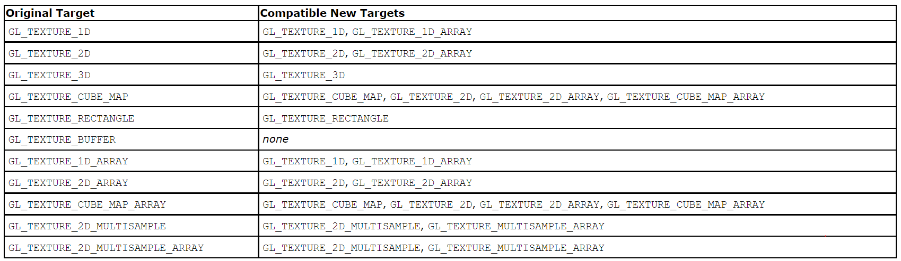

关于mesa架构方面，[这篇文章讲的比较清楚](https://blog.csdn.net/HaoBBNuanMM/article/details/109054106)，[还有这个](https://zhuanlan.zhihu.com/p/398226773)，[还有这个](http://joyxu.github.io/2021/05/13/gpu05/)

关于mesa的代码结构方面，[这篇文章讲的比较清楚](https://winddoing.github.io/post/39ae47e2.html)

mesa的官网下载地址：https://archive.mesa3d.org/

后续做源码剖析会根据opengl和vulkan不同API类别分别做剖析

opengl重点文件：.\src\mesa\main,    .\src\mesa\state_tracker,会涉及到一些,\src\gallium


**经典流程：**

```
mesa/main下面文件:  _mesa_BufferData —— _mesa_buffer_data —— _buffer_data —— pipe->buffer_subdata

gallium/drivers下面文件：
r600_buffer_subdata（以Amd r600为例）/ i915_buffer_subdata（以intel i915为例）—— memcpy
```

# opengl-mesa实现

所有的入口函数都是_mesa_xxxx,例如_mesa_BindBuffer、_mesa_BindBufferRange等。

当前进度61/136

### 几个发现：

##### 1. glrenderbuffer和gltexture的区别

renderbuffer和texture的区别在于。renderbuffer支持stencil缓冲区，但是renderbuffer不能被shader直接使用，想要被使用的话只能通过fbo，fbo的wiki写的非常清楚：

[https://www.khronos.org/opengl/wiki/Framebuffer_Object](https://www.khronos.org/opengl/wiki/Framebuffer_Object)

##### 2. glInvalidateSubFramebuffer其实什么都没做

他的操作很简单，实际上只是检查一下参数，然后，什么都没有做！！！！！！！！对！连状态设置都没有做，只是检查了一下参数。

##### 3. glGenxxx创建的是假buffer、glCreatexxx是直接创建资源的

##### 4. 同一个接口，有硬件实现，有dma实现，也有driver的软实现，也有mesa的软实现，效率千差万别，对于经常使用的接口或者明显比较慢的接口，可以多研究一下判断条件

例如mesa的glGetTexImage这个接口主要是获取texture里面pixel的数据的，，调用pipe的blit接口.blit接口是相对高效的方法，如果有些条件不符合，例如是GL_DEPTH_STENCIL（因为有些driver对DEPTH stencil支持不好，所以干脆就走了软件blit（这里是用compute shader实现的），会慢很多）。如果再有某些条件不满足，则使用CPU做copy，效率就更低了。

##### 5. glcopy和glblit走的是不同的逻辑，也是用的不同的驱动

glcopy更多的是考虑纹理格式转换，是否压缩，长宽高。而blit则更多的考虑是否有脏数据，能不能直接拷贝，整体来看blit拥有很多优化手段，效率会更高一些。


### buffer（共15个接口）

buffer入口 src\main\mesa\bufferobj

gallium的r600(AMD驱动接口)对应gallium/drivers/r600/r600_blit.c和gallium/drivers/r600/r600_buffer_common.c

##### glGenBuffers和glCreateBuffers

注意这两个接口类似，但是他们的作用不太一样，他们都会调用create_buffers里面，这时会有一个dsa的标记，glCreateBuffers（dsa=true）会直接创建一个新的buffer，而glGenBuffers（dsa=false）则会创建一个虚假的buffer，把buffer创建延迟到glbindbuffer或者bufferdata（真正使用）的时候。然后调用new_gl_buffer_object申请一块新的buffer。

**流程：**添加锁——释放僵尸buffer——通过hash找到bufferid——调用new_gl_buffer_object——_mesa_bufferobj_alloc申请buffer——释放锁

##### glBindBuffer

入口函数_mesa_BindBuffer，调用到bind_buffer_object，

**流程：**查找当前绑定buffer是否重复绑定 —— 查找当前需要绑定的buffer —— 如果是虚假buffer则需要申请新buffer——调用_mesa_reference_buffer_object_做buffer指针赋值。切换到新buffer上

##### glBindBufferRange

入口函数_mesa_BindBufferRange——bind_buffer_range，该函数是把指定的buffer范围绑定到指定的GPU index上。

他会根据target的不同，通过switch到别的接口，如下所示：


**流程：**_mesa_BindBufferRange——bind_buffer_range——\_mesa_reference_buffer_object(主要是把当前的buffer绑定到ctx上的uniformbuffer上) —— bind_uniform_buffer——bind_buffer（主要是把buffer绑定到ctx->UniformBufferBindings[index]上面，其实就是下面这段代码：

```
_mesa_reference_buffer_object(ctx, &binding->BufferObject, bufObj);
binding->Offset = offset;
binding->Size = size;
binding->AutomaticSize = autoSize;
```

##### glBindBufferBase

和glbindbufferrange类似，只不过bindbufferbase的接口少了offset和buffersize。里面的实现一样。但有一点不同，就是他传入offset和size的时候会传入一个AutomaticSize的flag，表示后面再获取size。在真正使用的时候，会默认使用当时的buffersize，只有AutomaticSize为false时，才会使用bindbufferrange的size。如下所示：


**流程：**_mesa_BindBufferBase——bind_buffer_base_uniform_buffer——\_mesa_reference_buffer_object(主要是把当前的buffer绑定到ctx上的uniformbuffer上) —— bind_uniform_buffer——bind_buffer

##### glBindBuffersBase和glBindBuffersRange

预留接口，在ARB_multi_bind扩展中使用，实现的时候就是比glBindBufferBase/glBindBufferRange多一个for循环

##### glBufferData 和glBufferSubData

**流程：**_mesa_BufferData —— get_buffer（获取当前buffer）—— _mesa_buffer_data——\_ buffer_data——\_mesa_buffer_unmap_all_mappings(把所有已经map的buffer都unmap掉，因为现在要写入数据了)——\_mesa_bufferobj_data——bufferobj_data——pipe->buffer_subdata（gallium）——r600_buffer_subdata（以Amd r600为例）/ i915_buffer_subdata（以intel i915为例）—— memcpy

##### glClearBufferSubData 和glClearBufferData

如果没有硬件驱动实现，则会退化成软件实现，软件实现就是使用memcpy把clearvalue复制到dest上面。虽然硬件感觉也差不多。。

**流程：** _mesa_ClearBufferSubData —— clear_buffer_sub_data —— clear_buffer_subdata_sw / pipe->r600_clear_buffer —— 硬件dma支持，或者走memcpy流程。

##### glMapBufferRange和glMapBuffer

首先要getbuffer，然后把pointer、length、offset和access都存进去。

这里会有一些防呆设计，比如对调用者没有调用对时的修改。。map是会对每一个index存一套offset、length和access的。map出来的pointer也是通过pipe驱动获得。

glMapBuffer也是走的glMapBufferRange的流程。

**流程：**_mesa_MapBufferRange —— map_buffer_range —— _mesa_bufferobj_map_range——r600_buffer_map_sync_with_rings —— radeon_winsys里面的buffer_map（这个是闭源的，可以参考纯软的kms_dri_sw_winsys.c）

##### glUnmapBuffer

unmap就是把gl_buffer_object里面的内容全部置为空，然后调用驱动的buffer_unmap

##### glInvalidateBufferSubData和glInvalidateBufferData

也是首先使用lookup_bufferobj查找到buffer，然后调用bufferobj_invalidate。注意如果这个buffer已经被map了，是无法做invalidate操作的。

这两个会调用到r600_invalidate_resource，AMD的驱动会reallocate buffer并且更新所有资源的binding。

glInvalidateBufferData走的也是glInvalidateBufferSubData的路子

##### glCopyBufferSubData

首先getbuffer，然后调用bufferobj_copy_subdata，当前的buffer是不能被map的，如果被map会发生崩溃。

然后调用驱动的resource_copy_region，将一块pixel从一个res拷贝到另一个，这两个res必须是同样的格式。

然后会调用到r600_resource_copy_region里面，也会检查能否使用dma，如果不行的话就会fallback到r600_resource_copy_region里面，使用memcpy和buffer_map/texture_map来拷贝buffer。

### shader（共22个接口）

shader入口 src\mesa\main\shaderapi.c和src\mesa\main\pipelineobj.c

##### glcreateshader

createshader之前需要添加锁，然后需要确认当前shader的stage，opengl的shader stage如下所示：


然后会创建一个新的shader，关键代码只有几行，很简单：

```c++
struct gl_shader *shader;
shader = rzalloc(NULL, struct gl_shader);
if (shader) {
    shader->Stage = stage;
    shader->Name = name;
    shader->RefCount = 1;
    shader->info.Geom.VerticesOut = -1;
    shader->info.Geom.InputType = SHADER_PRIM_TRIANGLES;
    shader->info.Geom.OutputType = SHADER_PRIM_TRIANGLE_STRIP;
}  
```

##### glshadersource和glshadersourceARB

这个接口的入口函数是\_mesa_ShaderSource

首先会去找需要shadersource的shaderobj，中间会申请一个新的source的空间，把shader拷贝进这个新的变量里面，然后计算sha1，将sha1保存到最开始寻找到的shaderobj里面，然后将shader内容保存到shaderobj里面。

shadersource只做了保存变量和计算sha1的操作，没有编译也没有做优化。

##### glcompileshader

编译源代码：src/compiler/glsl/glcpp/

入口函数\_mesa_CompileShader和_mesa_compile_shader

首先仍然是寻找shaderobj，如果shadersource是空的话，会返回一个COMPILE_FAILURE，而不会崩溃或者抛出GL_ERROR。之后会初始化build_in function，例如step、textureSize2D等，只需初始化一次。

然后就去编译shader，shader的编译过程有些复杂，[这篇文章](http://joyxu.github.io/2021/06/15/gpu-mesa-compile/)可以帮忙梳理下流程，里面有张图可以作为学习参考。


在glcompileshader里面，走的应该是glslshader到GLSL IR的步骤。包括检查shader里面是否有#include（有的话就检查剩余的shadercache，有的话就跳过），还有preprocess（删除空行（\n,\r,\r\n,\n\r）等，这里用的是glcpp处理，细节追不到），这个时候应该就已经解析成语法树了。然后通过_mesa_ast_to_hir转换成hir，经过precision等的优化，还有编译验证，sha1计算等操作，compile这一步就算结束了。

##### glshaderbinary

仍然需要先寻找shaderobj，验证通过后直接将spirv保存下来即可，按照上面那张图来看。spirv和glsl ir是同级的。spirv的shader有一个gl_spirv_module属性，他用来保证同样的spirv被不同shaderobj引用时的一个计数。

##### glreleaseshadercompiler

入口函数_mesa_ReleaseShaderCompiler，只是把单例builtin_builder的builin_users数量减少并且release掉。

##### glcreateprogram

入口函数_mesa_CreateProgram和create_shader_program。和glcreateshader类似，整体来说也是创建了一个gl_shader_program，代码简单来看就是下面这样的。

```C++
struct gl_shader_program *shProg;
shProg = rzalloc(NULL, struct gl_shader_program);
if (shProg) {
    shProg->Name = name;
    shProg->data->RefCount = 1;
    shProg->data->InfoLog = ralloc_strdup(data, "");
    if (!shProg->data) {
        ralloc_free(shProg);
        return NULL;
    }
	shProg->Type = GL_SHADER_PROGRAM_MESA;
    shProg->RefCount = 1;
    shProg->AttributeBindings = string_to_uint_map_ctor();
    shProg->FragDataBindings = string_to_uint_map_ctor();
    shProg->FragDataIndexBindings = string_to_uint_map_ctor();
    shProg->Geom.UsesEndPrimitive = false;
    shProg->Geom.ActiveStreamMask = 0;
    shProg->TransformFeedback.BufferMode = GL_INTERLEAVED_ATTRIBS;
    exec_list_make_empty(&shProg->EmptyUniformLocations);
}
return shProg;
```

##### glattachshader

入口函数_mesa_AttachShader和attach_shader。

顾名思义，就是把shader和对应的program赋值一下，然后把老的shader里面的reference去掉。就没别的操作了。

##### gllinkprogram

走的是src/compiler/glsl/linker.cpp的代码

入口函数_mesa_LinkProgram和link_program，link之前首先要保证transform_feedback没有在使用当前program。然后依然要保证shader的builtin函数是已经完成了的。然后执行\_mesa_glsl_link_shader，这时可以使用spriv，也可以用glsl  ir来做link，然后根据shader stage，一个一个的去把uniform、ssbo、block、bindless等解析出来，和现有的CPU端obj信息 link起来。经过这一个阶段，我们的shader就变成可执行代码了。

在link阶段会做很多优化，例如对varing 的优化，对ssbo的优化，检查是否存在循环link，还有很多优化工作，最后还会验证整个shader是否link对了，做一些validation

##### gluseprogram

入口函数_mesa_use_shader_program。

有两个步骤，一个是_mesa_use_program，一个是\_mesa_active_program.

_mesa_use_program就是切换到这个program，同时切换的还有vertexprogra、fragmentprogram和geo progra，并且unreference老的program，允许out-of-order draw（其实就是drawcall 合并）。同时还会更新render_state的一系列状态量，验证uniform和sampler是否是valid的，验证fragment/xfb是否可用，geometry shader是否支持等。

整体看下来gluseprogarm耗时还是挺长的，并不是简单的仅仅切换一个program

##### glcreateshaderprogramv

入口函数_mesa_CreateShaderProgramv

把几件事情放在一起做了，首先create_shader,然后做shadersource、在做glcompileshader，再做createprogram，再做attachshader和linkprogram，最后再delete shader。基本上算是个缝合怪。一个接口完成以后就可以直接useprogram了。

##### glprogramparameteri

只是更改了一下某个program下面某个参数的值，pname只支持两个枚举，分别是GL_PROGRAM_BINARY_RETRIEVABLE_HINT和GL_PROGRAM_SEPARABLE。感觉这个接口很少用

##### glgenprogrampipelines

这个函数的入口在pipelineobj.c的_mesa_GenProgramPipelines函数中，接口的作用是把从vertex 阶段到fragment shader阶段的所有配置都存起来。和其他genxxx一样，这个接口创建了n个新的pipeline object，伪代码如下：

```
struct gl_pipeline_object *obj = rzalloc(NULL, struct gl_pipeline_object);
if (obj) {
    obj->Name = name;
    obj->RefCount = 1;
    obj->Flags = _mesa_get_shader_flags();
    obj->InfoLog = NULL;
}
```

##### glbindprogrampipeline

入口函数也在pipeline's里面，bind_program_pipeline。

首先需要找到有没有对应的pipelineobj，然后将pipelineobj绑定到对应的binding point上。然后把program里面所有的stage里面的uniform等绑定点设置好。之后设置vertex process的状态，设置drawcall乱序绘制的优化，还有绘制raster的一些设置选项，例如draw的mask（font face/back face/triangles/triangle_strip等）

##### gluseprogramstages

这个是opengl的特性，主要是把某个program绑定到pipeline的多个stage上面。从而复用某个管线的阶段性代码。

在实现过程中，也会首先寻找是否存在这个pipeline和这个program，以及当前的pipeline是否存在geometry shader/compute/tessellation 的stage。然后依次将stage的maskbit和各个stage bit做比较，如果有某个stage则把某个program绑定到对应的pipeline object上。然后会根据不同的stage最终调用到gluseprogram。

##### glactiveshaderprogram

也是opengl的特性，opengl的pipelineobject保证同一个vertex shader可以和多个fragment shader组合，减少重复，而glactiveshaderprogram这个接口就是类似glactivetexture和gluseprogram结合的意思，就是激活某个stage，然后在这个stage上调用gluseprogram。

在mesa的实现里面，是先寻找pipeline object，再去寻找对应的program，然后把当前pipeline的activeprogram替换成当前寻找的program。

##### glprogrambinary

入口函数_mesa_ProgramBinary，

简单暴力，把当前program的shader数据清除掉，然后替换成传入的shaderbinary数据，同时计算sha1和调用对应的gluseprogram。中间会验证binary是否是正确的，也会验证binary的crc值，

##### glgetuniformlocation

入口在mesa\main\uniforms.c的_mesa_GetUniformLocation_impl(GLuint programObj, const GLcharARB *name, bool glthread)里面，作用是找到某个program对应某个特定uniform名称的location。

具体做法就是先找到对应name 的resource，mesa维护了一套name - resource的map，然后再去根据resource找到对应的array index

##### glGetActiveUniform

下面是这个接口的详细定义，其中length以后都是return的值，意思就是说只要有index和program，就能拿到这个uniform的所有信息


在mesa里面，入口函数在uniform_query.cpp里面的_mesa_GetActiveUniform_impl中，

仍然是先要找到对应的program资源，然后根据资源获取这个uniform的名字，长度，对应的数据类型，以及arraysize。

##### glUniform{1234}v

实际上所有的gluniform*到最后都会调用到mesa\main\uniform_query.cpp中的_mesa_uniform这个接口.gluniform\*的那些接口在mesa\main\uniforms.c中都可以找到，看起来还挺整齐壮观的。

因为把gluniform*都归一化到同一个入口里面了，所以mesa里面的做法其实挺复杂的，gluniform也并没有想象中的那么快，首先他要验证uniform的值是否valid，对于64bit的值，还需要做拆分，然后去将uniform值做packing，然后将packing的值通过memcpy保存到一个driver_storage里面。然后使用_mesa_flush_vertices_for_uniforms，将数据通过driver刷到GPU上。中间还有一些数据转换，例如float2half。

##### uniformBlockBinding

这个函数就是把某个uniform绑定到特定program的绑定点上，入口函数也在uniforms.c里面，

实现起来也含简单，mesa存了一个uniformblocks的map，直接对对应uniformindex新增一个绑定点即可，代码如下

```C++
static void uniform_block_binding(struct gl_context *ctx, struct gl_shader_program *shProg, GLuint uniformBlockIndex, GLuint uniformBlockBinding)
{
   if (shProg->data->UniformBlocks[uniformBlockIndex].Binding !=
       uniformBlockBinding) {

      FLUSH_VERTICES(ctx, 0, 0);
      ctx->NewDriverState |= ST_NEW_UNIFORM_BUFFER;

      shProg->data->UniformBlocks[uniformBlockIndex].Binding =
         uniformBlockBinding;
   }
}
```

##### GetSubroutineUniformLocation

入口函数在mesa\main\shaderapi.c的_mesa_GetSubroutineUniformLocation。这个函数的作用就是在glsl中，支持subroutine关键字，他相当于是shader的子程序，类似函数指针。GetSubroutineUniformLocation就是获取子程序uniform的位置，结合glGetSubroutineIndex可以获取对应函数指针的位置，就可以在CPU端控制GPU调用的函数指针。这里有个例子：

https://blog.csdn.net/coldkaweh/article/details/49966731

在mesa的实现中，首先要判断shader、program是否valid，然后找到对应的shaderstage。然后根据shaderstage获取具体是哪种resource类型。然后走的是glGetUniformLocation的路线，先找到对应name 的resource，再去根据resource找到对应的array index

##### MemoryBarrier

入口函数在mesa\main\barrier.c的memory_barrier_by_region里面。这里面实现很简单，判断barrier的类型，添加flag，然后直接调用驱动pipe里面的memory_barrier接口。以AMD为例，会调用到gallium\drivers\r600\\r600_state_common.c里面的r600_memory_barrier。这个函数只是设置了一些flag，估计到执行的时候才会有实际操作。

### query（共4个接口）

##### glGenQueries

入口函数mesa\main\queryobj.c里面的create_queries，和glGenBuffers\glCreateBuffers一样，glGenQueries和glCreateQueries也类似

具体的操作也是创建了一个query_object，代码如下：

```
struct gl_query_object *q = CALLOC_STRUCT(gl_query_object);
if (q) {
    q->Id = id;
    q->Ready = GL_TRUE;
    q->pq = NULL;
    q->type = PIPE_QUERY_TYPES; /* an invalid value */
    return q;
}
```

##### glBeginQuery和glBeginQueryIndexed

两个都会调用到mesa\main\queryobj.c里面的_mesa_BeginQueryIndexed，不过glBeginQuery会把index设置成0。

首先，mesa查找当前target query的binding point，然后回去查找是否存在当前的query object。然后将GL query type转换成gallium的query type，例如GL_ANY_SAMPLES_PASSED转换成PIPE_QUERY_OCCLUSION_PREDICATE、然后调用pipe的create_query，例如r600_create_query，之后又分为软件query和硬件query。硬件query会调用操作系统的virtual memory

##### glEndQuery和glEndQueryIndexed

和glbeginquery上面相同，甚至连流程都一样

##### glGetQueryiv

实际上接口是_mesa_GetQueryIndexediv，接口是

| `void **glGetQueryIndexediv**(` | GLenum target,     |
| ------------------------------- | ------------------ |
|                                 | GLuint index,      |
|                                 | GLenum pname,      |
|                                 | GLint * params`)`; |

params会根据传入的pname，返回对应的值，而值全都存在context里面。基本就是一个switch搞定一切

### texture（共25个接口）

实现文件集中在mesa\main\texobj.c、mesa\main\texstate.c、mesa\main\samplerobj.c

##### glActiveTexture

入口函数在mesa\main\texstate.c里面的active_texture，只做了一件事：

```
   ctx->Texture.CurrentUnit = texUnit;
   if (ctx->Transform.MatrixMode == GL_TEXTURE) {
      /* update current stack pointer */
      ctx->CurrentStack = &ctx->TextureMatrixStack[texUnit];
   }
```

##### glGenTextures

glCreateTextures 和glGenTextures一模一样，不像buffer是延迟申请的。

入口函数在mesa\main\texobj.c里面的create_textures上，做了两件事情，一个是创建一个texture obj，这个比较简单，然后初始化这个textureobj，这一步很复杂，因为textureobj的属性太多了，包括sample的规则texture的Attrib、mipmap、layer、是否是bindless等等。但他没有调用驱动，说明是上层控制的。

##### glBindTexture

bindtexture入口函数mesa\main\texobj.c里面的_mesa_bindTexture，整体的流程和glbindbuffer类似

首先调用_mesa_lookup_or_create_texture，寻找是否存在需要bind的texture，如果存在的话，直接返回要bind的texture，否则则新创建一个texture，并且也会初始化这个新建的texture，类似glGenTextures。

##### glDeleteTextures

入口函数mesa\main\texobj.c里面的delete_textures，因为可以delete多个textures，所以里面首先就是一个for循环，然后依次寻找texture——lock texture —— unbind texture from  fbo —— unbind texture from texunits  —— unbind texture  from  image unit ——把texture 查找表、sampler等都删掉，把当前texture object reference 成null，因为是mesa自己实现的智能指针，所以会自动删掉。（这里总感觉会有风险）

##### glGenSamplers

入口函数mesa\main\samplerobj.c里面的_mesa_GenSamplers，然后调用create_samplers，和其他的glGenxxx一样，glGenSamplers其实就是申请了一个新的sampler_boject，然后对samplerobj的所有属性做初始化，sampler的属性也比较多，包括compareMode，wrap的方式等等。

因为这个接口是复数形式，所以里面也有一个for循环。在申请资源前后也需要加锁。所有申请资源的操作都需要加锁。

##### glBindSampler

入口函数在mesa\main\samplerobj.c的bind_samplers，

函数的实现很简单，先加锁，然后查找是否有对应的sampler obj，将当前的sampler切换成要绑定的sampler，然后解锁。

##### glSamplerParameter

入口函数在mesa\main\samplerobj.c的_mesa_SamplerParameteri

这个函数的作用是设置采样器参数，例如glSamplerParameter(sampler, GL_TEXTURE_WRAP_S, GL_REPEAT),

实现方式就是先通过一个switch，判断中间形参pname的值，然后判断param和pname的值是否valid，然后将参数复制进去就行了。对于有mipmap的sampler，还要把对应mipmap的参数设置好。

##### glGetSamplerParameter

入口函数在mesa\main\samplerobj.c的_mesa_GetSamplerParameteriv，检查参数合理性，然后返回sampler对应的参数即可，实现很简单。

##### glTexImage2D

入口函数mesa\main\teximage.c里面的_mesa_TextureImage2DEXT, \_mesa_TexImage2D等，但是包括glTexImage1D/2D/3D、glTextureImage1D/2D/3DEXT、MultiTexSubImage1D/2D/3D、glCompressedTexImage1D/2D/3D等在内的所有接口，到最后都会调用到teximage里面，

这个接口在实现的时候会首先判断target是不是有效的（包括pc上的gl，gles对target格式的支持都不同），然后根据texture target从context里面获取对应的texture object。如果是compressed image，则需要把compressed的数据解压转换成decompressing 的texture，这里是用CPU转换的。

如果是proxytexture，则需要get对应的proxy texture，并且更新 proxy texture的属性。如果是non-proxy的texture，则需要首先拿到texture_image的object（主要是有mipmap的关系），然后把当前textureImage的数据清空掉。然后设置初始化textureImage的属性和。调用st_TexSubImage，转换成gallium的坐标系，还有转换图片的格式和数据地址，最后调用gallium的texture_subdata。（这个是最快的方法）

在这个过程中，有许多检查，例如格式不匹配，格式不支持，或者获取不到格式，或者不支持NPOT的格式，他们最终都会fallback到mesa的CPU实现。

在中间还会检查是否存在unpack的PBO，如果存在的话，则没有办法使用gallium的texture_subdata，则需要通过map—— memcpy——unmap的方式上传纹理数据。

最最后还需要check和gen一下mipmap。

整体看下来，glTexImage2D等接口实现起来非常复杂。估计效率也是十分堪忧的，和预期一致。

##### glCopyTexImage2D

入口函数mesa\main\teximage.c里面的_mesa_CopyTextureImage1D/2DEXT，\_mesa_CopyTexImage1D/2D、\_mesa_CopyMultiTexImage1D/2DEXT等。

以上这些接口最终都会调用到copyteximage函数里面。

首先要做的仍然是格式转换，获取texture obj，然后加锁，判断是否可以避免rellocation（这个可以快20倍，主要是要保证格式一致，border一致，长宽一致），如果可以避免rellocation，则直接使用st_CopyTexSubImage，这个时候有两种实现方法，一种是硬件使用pipe的blit方法，另外一种是fallback到软件实现。最后需要check_gen_mipmap，并且unlock texture。

如果需要rellocation，则首先仍然是判断格式是否符合，以及TexImage是否有proxy，如果有的话，先用proxy做一些条件上的剔除（主要是image大小的检查）。然后get texture image的obj，并且把原有数据free掉。做alloc新的TextureImageBuffer，然后再走之前的copytexsubimage。同时要检查对应的FBO之间的引用关系。

##### glTexSubImage2D

和glteximage相比，gltexubimage2D直接调用st_TexSubImage，要直观很多。这里面最主要的原因是glTexSubImage2D不需要考虑是否压缩，格式也没有那么复杂。仅从mesa实现的角度来看，这个接口比glteximage要快一些。

##### glCompressedTexImage2D

和glteximage一模一样，只不过里面调用了不少类似compressed_texture_error_check的函数，很多判断是单独进行的。

##### glTexImage2DMultisample

入口函数mesa\main\teximage.c的_mesa_TexImage2DMultisample,

首先需要检查当前硬件是否支持MSAA，不支持或者sample数量小于1的话直接就return。然后检查texture format是否支持，然后判断sample count和opengl版本，硬件支持的关系是否符合要求，然后再去获取texImage，free textureImage里面的内存，inittexImage，然后在state_tracker里面创建纹理，

但是和glteximage2D不同的是，他并没有传入数据，而sample count只是teximageobj里面的一个属性，设置完以后就结束了。

##### glTexBufferRange

这个接口是把一个buffer和一个texture连在一起。当然texture object一定是一个buffer texture。buffertexture是没有mipmap的，也没有filter，但是他可以允许shader使用texelFetch去访问一大块内存。

入口函数也在mesa\main\teximage.c里面，是texture_buffer_range，这个入口会把glTexBuffer、glTexBufferRange、glTextureBuffer和glTextureBufferRange归纳到一起。

这个接口首先也是check format，检查是否支持texture buffer，然后lock texture，然后把bufferobject和texobj attach到一起。unlock texture，对于texture object，解锁所有的sampler（因为buffertexture是没有sampler的）。结束

##### glTexParameteri

入口函数mesa\main\texparam.c里面的_mesa_texture_parameteri.

主要是根据pname，以及对应的target，找到对应的texobj，检查赋值是否valid，然后赋值。对于GL_TEXTURE_LOD_BIAS，则需要把所有的texture parameter都失效掉（例如把所有的sampler view失效）

##### glGetTexParameter

入口函数在mesa\main\texparam.c里面的_mesa_GetTexParameteriv

这个接口实现起来也很简单，直接从textureobj里面的状态获取就好了，只是获取的时候需要关注不同opengl的版本，以及opengl和gles的区别

##### glGetTexImage

这个接口主要是获取texture里面pixel的数据的，

入口函数_mesa_GetTexImage

首先仍然是先拿到当前的texobj，然后获取texture image的大小（width、height和depth）然后根据mipmaplevel获取对应的teximage object。然后会调用state_tracker的st_GetTexSubImage，调用pipe的blit接口.blit接口是相对高效的方法，**如果有些条件不符合，例如是GL_DEPTH_STENCIL（因为有些driver对DEPTH stencil支持不好，所以干脆就走了软件blit（这里是用compute shader实现的），会慢很多）。如果再有某些条件不满足，则使用CPU做copy，效率就更低了。**

##### glEnable和glDisable

入口函数在mesa\main\enable.c的_mesa_Enable里面，两者到最后都会调用到\_mesa_set_enable.

和想象中的一样，这个接口实现起来基本就是对context做一个赋值操作，这个函数的代码有1000行。但是有的glenum会有额外操作，以GL_BLEND为例，如果新设置的enable状态和老的状态不一样，则需要更新vertices的状态，还需要draw out of order的状态，还有render_state的状态。也就是说，某些glEnum会影响到别的操作的地方，都需要进行更新。

##### glGenerateMipmap

入口函数在mesa\main\genmipmap.c。

实现起来仍然是先lock_texture，然后选择需要生成的textureimage，确保需要生成的mipmap format是valid的。并且对于compressed texture，是不允许直接生成mipmap的。最后会根据是否是cubemap，来调用state_tracker里面的st_generate_mipmap，判断硬件是否有generate_mipmap的接口，这个仍然是最快的生成方法，如果没有这个接口，则使用mesa的软件实现。这个时候就能生成compressed texture的mipmap了

##### glTextureView

入口函数mesa\main\textureview.c里面的_mesa_TextureView

注意这里的gltextureview和android的textureview是不同的概念，这里主要的作用是通过一张texture来创建一个textureview，textureview可以理解为是texture的别名，他们共享数据

在mesa的实现过程中，首先寻找两个textureobj，然后检查两个textureobj的格式是否匹配，匹配的格式列表如下



详细可以查看https://registry.khronos.org/OpenGL-Refpages/gl4/html/glTextureView.xhtml

然后根据现在的format去查询真正的hardware格式，格式对于硬件来说非常重要，正确的格式可以让texture的速度快几倍。然后会通过硬件查询目标texture的大小是否符合要求，如果不符合要求就会抛一个GL_ERROR出来。最后会初始化新的texture，这个初始化过程并不会调用驱动函数，而只是把每一个level，每一个face做一下初始化。最后会把pointer做一下赋值。

##### glTexStorage2D

glTexStorage1D/2D/3D和gltextureStorage1D/2D/3D都会调用到同一个函数，入口函数在mesa\main\texstorage.c里面texstorage_error

首先仍然是check target和format是否符合要求,然后再去查找对应的hardware format，查找长宽深度是否符合要求，然后初始化texture，申请内存，清除texture，最后update fbo 的texture。

相比较gltextureImage，这个接口不需要考虑PBO，也不需要考虑compressed，也不需要考虑mipmap，实现起来相对要简单一些。但复杂度也比较高了。

##### glTexStorage2DMultisample

入口函数在mesa\main\teximage.c里面的_mesa_TexStorage2DMultisample

走的居然是texture_image_multisample，和textureImageMultisample一模一样

##### glInvalidateTexSubImage

入口函数在mesa\main\texobj.c里面的_mesa_InvalidateTexSubImage

先get  texobj和对应的teximage，然后把里面的属性都设置成0即可。没有调用驱动。非**常简单高效**

##### glBindImageTexture

入口函数在mesa\main\shaderimage.c里面的_mesa_BindImageTexture，然后调用到bind_image_texture

这个函数的作用是把一个level的texture绑定到一个imageunit（activetexture的那个）上。

实现起来也很简单，做一些format上的检查，layer的检查，然后直接绑定就行了。

### framebuffer（共23个）

常用文件mesa\main\fbobject.c

##### glGenFramebuffers

入口函数create_framebuffers

申请一个gl_framebuffer的空间，然后初始化就可以了，记得加锁，代码如下

```
fb->Name = name;
fb->RefCount = 1;
fb->_NumColorDrawBuffers = 1;
fb->ColorDrawBuffer[0] = GL_COLOR_ATTACHMENT0_EXT;
fb->_ColorDrawBufferIndexes[0] = BUFFER_COLOR0;
fb->ColorReadBuffer = GL_COLOR_ATTACHMENT0_EXT;
fb->_ColorReadBufferIndex = BUFFER_COLOR0;
fb->SampleLocationTable = NULL;
fb->ProgrammableSampleLocations = 0;
fb->SampleLocationPixelGrid = 0;
fb->Delete = _mesa_destroy_framebuffer;
```

##### glBindFramebuffer和glbindFramebufferEXT

入口函数_mesa_BindFramebuffer，调用到bind_framebuffer

先检查格式。然后查找有没有想要的framebuffer，如果不存在drawfb的话，还需要创建一个framebufer，然后将context的状态切换成当前的fb。老的fb需要检查是否有framebufferattachment，如果有的话需要对每一个texture调用driver的FinishRenderTexture，告诉他们我们已经切换fb了（其实就是添加了一个dirty的标志）

也要告诉driver我们新的texture是哪些

##### glFramebufferParameteri

入口函数_mesa_FramebufferParameteri

三部曲：检查参数合理性——获取需要改变参数的fb——参数赋值，和gltextureparameteri相比，甚至没有额外的依赖和操作

##### glBindRenderbuffer和glBindRenderbufferEXT

入口函数bind_renderbuffer，

仍然是先查找renderbuffer，如果renderbuffer是假的（延迟申请）那就通过allocate在申请一个renderbuffer，最后将context上的renderbuffer状态切换成查找到或者新申请的renderbuffer。

##### glGenRenderbuffers和glCreateRenderbuffer

入口函数create_render_buffers，

glGen是申请了一个假的buffer，延迟申请，glCreate则是立即申请一个真的buffer。当然申请前要先lock，申请后要unlock

##### glRenderbufferStorageMultisample和_mesa_RenderbufferStorageMultisampleAdvancedAMD

入口函数renderbuffer_storage_target

renderbuffer和texture的区别在于。renderbuffer支持stencil缓冲区，但是renderbuffer不能被shader直接使用，想要被使用的话只能通过fbo，fbo的wiki写的非常清楚：

[https://www.khronos.org/opengl/wiki/Framebuffer_Object](https://www.khronos.org/opengl/wiki/Framebuffer_Object)

这个接口的实现，首先会将internalFormat转换成baseFormat，然后check硬件是否支持samplecount，然后将传入的数据（width，height，samplecount，format）赋值给这个renderbuffer。就完成这个接口的功能了。

##### glRenderbufferStorage

同上，除了sample数是0，基本没区别

##### glGetRenderbufferParameteriv

直接返回renderbuffer对应的属性

##### glGetShaderSource

入口函数mesa\main\shaderapi.c

首先寻找shaderobj，然后通过for循环和maxlength把shader内容一个一个拷贝出来。简单暴力

##### glFramebufferRenderbuffer

入口函数mesa\main\fbobject.c的_mesa_FramebufferRenderbuffer

首先根据target找到对应的gl_framebuffer的object，然后获取这个fb里面的attachment（这个attachment是传入的）后面直接用软件实现这一过程了，没有用到硬件的FramebufferRenderbuffer！很奇怪。不过软件就是把fb的attachment设置成我们想要的renderbuffer

##### glFramebufferTexture 1D/2D/3D MultisampleEXT/layer

入口文件在fbobject.c，

顺序大致是：\_mesa_FramebufferTextureLayer/\_mesa_FramebufferTexture/ → frame_buffer_texture → \_mesa_framebuffer_texture

_mesa_FramebufferTexture1D/2D/3D{Multisample} → framebuffer_texture_with_dims → \_mesa_framebuffer_texture

frame_buffer_texture主要是get framebuffer object，get texture object和framebuffer attachment，同时检查一下layer、level和target的关系，判断texture和attachment是否valid

framebuffer_texture_with_dims  则只获取framebufferboject和texture，attachment的获取不会做过多的分支判断。

##### glDrawBuffer、glDrawBuffersARB和glDrawBuffers

入口函数_mesa_drawbuffers，

首先根据传入的enum计算mask，然后根据drawbuffer的index，依次更新drawbuffer，实际只是把fb的status更新了一下，更新的内容是fb->_ColorDrawBufferIndexes[buf] 

##### glColorMask

只是更新一下colormask的状态

##### glStencilMask

更新context下面stencil的writemask的状态，以及newDriverState的状态。

##### glClear

入口函数mesa\main\clear.c里面的_mesa_Clear

glclear实际上已经算是draw的一种了，首先要判断各种mask和context state是否合理，然后获取renderbuffer、scissor以及对应的clearvalue。在获取所有状态信息以后，调用驱动的clear函数。例如r600_blit.c里面的r600_clear函数。驱动里面有很多可以加快clear的接口，例如clear_buffer接口dma_clear_buffer接口等。**仔细研究他们的条件可以提升clear的效率**

##### glClearColor

只是设置一下context中color的状态

##### glInvalidateSubFramebuffer

入口函数mesa\main\fbobject.c里面的_mesa_InvalidateSubFramebuffer。

在拿到fb以后调用invalidate_framebuffer_storage

invalidate的操作很简单，实际上只是检查一下参数，然后，什么都没有做！！！！！！！！

##### glReadPixels

入口函数在mesa\main\readpix.c里面的_mesa_readpixels

他会首先尝试memcpy，据说这个是最高效的，不同的attachment条件不同，例如对于Depth，就必须depthscale是1，depthbias是0，并且internal format和mesaformat一定要一致，然后通过map调用硬件能力使用memcpy。如果用不了硬件，则会根据format的类型不同走不同的map。也会用硬件能力，但是要走pack和unpack的流程，由于需要pack和unpack，所以需要额外malloc和free一个中间变量。导致速度比较慢。而且如果是color的话，还有格式转换等操作

##### glReadBuffer

和glDrawbuffer一样，只是切换一个context的buffer变量而已。

##### glBlitFramebuffer

入口函数mesa、main/blit.c里面的\_mesa_BlitFramebuffer

首先更新readfb和drawfb的所有状态，例如绑定了哪些attachment，buffer的mask，基本上又调用了一次gldrawbuffer和readbuffer。然后要对color做clamp，获取scissor box，检查两个buffer的状态，filter，mask，sample等，依次检查color buffer的状态，stencil buffer的状态、depth buffer的状态。等所有的检查都做完，最后才会调用到do_blit_framebuffer

在do_blit_framebuffer里面，如果bitmap cache里面有东西，需要draw或者flush掉，如果有readpixel cache，那也要刷掉，防止拷贝了脏数据。然后使用buffer大小和scissor来clip数据。最后输出两个buffer的clip数据。然后做坐标系变换，翻转y轴。如果是color buffer blit，则要先区分是texture还是renderbuffer，两者的resource获取方式有差别。获取到resource地址后，调用驱动的blit，来做真正的blit。depth和stencil与color的流程类似。

到驱动里面又有很多操作，例如AMD会走入到gallium/drivers/r600/r600_blit.c里面的r600_blit方法，dma_copy是最快的，他需要硬件支持，并且是LINEAR的格式。对region也有要求（format要一致，长宽都相同，也没有mask和filter，也没有blending）。

##### glCopyImageSubData

入口函数在mesa/main/copyimage.c里面的_mesa_CopyImageSubData

首先要准备目标资源，保证目标资源是没问题的，包括error checking还有相关的texture or renderbuffer是没问题的，然后再获取width，height，format。check 两个region是没问题的，format是相符合的。然后调用驱动的resource_copy_region，例如r600_resource_copy_region、注意这个和r600_blit是完全不同的接口！

##### glClampColor

入口函数在mesa/main/blend.c

做的事情很简单，把clamp的数据复制给context即可，只是要根据不同的target做switch

这个接口的作用就是在glreadpixels的时候自行设置那些数据是否要归一化到一定范围内（0-1）

### DrawVertexArray（共16个）

##### glVertexAttrib{1234}{s f d}

这个函数的入口在mesa/main/varray.c里面的_mesa_VertexAttribPointer.

函数的作用就是指定之前的VAO里面的顶点属性格式，参数类型：

(GLuint index, GLint size, GLenum type, GLboolean normalized, GLsizei stride, const GLvoid *ptr)

举个例子：

glVertexAttribPointer(0, 2, GL_FLOAT, GL_FALSE, sizeof(float)*2, (const void\*)(0));

就是顶点的位置是0， 整个顶点的数据大小是2，顶点数据类型是float，不用GPU归一化到-1到1，顶点的stride是2， 偏移量是0，

在实现的时候，首先要检查VAO，ArrayBuffer以及输入参数是否valid。然后获取并更新当前vao的array信息，最后bind一下当前的vao，所有的操作都是在CPU端做，没有使用驱动的任何接口。

##### glVertexAttribFormat

这个接口主要是修改制定vao的内容，多了一个vaobj，完整函数如下：

`void glVertexArrayAttribFormat(GLuint vaobj, GLuint attribindex, GLint size, GLenum type, GLboolean normalized, GLuint relativeoffset);`

从实现上来看，glVertexAttribFormat == bindvertexbuffer + _mesa_bind_vertex_buffer + 设置一下pointer和offset

##### glVertexAttribBinding

接口void glVertexAttribBinding(GLuint attribindex, GLuint bindingindex)
其中attribindex 指的是属性（attribindex）的index，bindingindex指的是bindvertexbuffer的第一个bindingindex，这个接口的作用就是把属性和buffer绑定在一起
关于这个接口的使用，可以查看[Separate_attribute_format](https://www.khronos.org/opengl/wiki/Vertex_Specification#Separate_attribute_format)


##### glEnableVertexAttribArray和glDisableVertexAttribArray

##### glVertexBindingDivisor

##### glBindVertexBuffer

入口函数在mesa/main/varray.c里面的_mesa_BindVertexBuffer上，最终调用到vertex_array_vertex_buffer。

主要操作就是根据当前context的vao，查找vao的bufferbinding下的bufferobject（VBO）如果查找不到就用当前传入的vbo，经过查找没问题后直接绑定找到的vbo

##### glGenVertexArrays

入口函数在mesa/main/arrayobj.c里面的gen_vertex_arrays

因为接口是复数形式，所以里面有个for循环，然后对于每一个vao，关键代码只有以下几行：

```
struct gl_vertex_array_object *obj = MALLOC_STRUCT(gl_vertex_array_object);
if (obj){
   memcpy(vao, &ctx->Array.DefaultVAOState, sizeof(*vao));
   vao->Name = name;
}
```

##### glBindVertexArray

入口函数在mesa/main/arrayobj.c的bind_vertex_array里面

传入参数一个context，一个id

实现过程就是先通过context和id找到当前的vao，为了防止drawarray指向一个unbound 并且要删除的VAO，这里需要把_EmptyVAO设置成空的防止crash，然后把context的VAO设置成找到的vao，最后更新render_state，

##### glDrawArrays

##### glDrawElementsInstancedBaseVertexBaseInstace

##### glDrawArraysIndirect

##### glMultiDrawArrays

##### glDrawRangeElementsBaseVertex

##### glMultiDrawElementsIndirect

##### glDispatchCompute

##### glDispatchComputeIndirect

### VertexAttribute（共5个）

##### glGetActiveAttrib

##### glGetAttribLocation

##### glBindAttribLocation

##### glValidProgram

##### glPatchParameterfv

### Transform Feedback（共9个）

##### glTransformFeedbackVaryings

##### glGetTransformFeedbackVarying

##### glGenTransformFeedbacks

##### glBindTransformFeedback

##### glBeginTransformFeedback

##### glEndTransformFeedback

##### glPauseTransformFeedback

##### glDrawTransformFeedback

##### glDrawTransformFeedbackStreamInstanced

### Rasterization(共17个)

##### glProvokingVertex

##### glGetMultisamplefv

##### glMinSampleShading

##### glPointSize

##### glPointParameter

##### glFrontFace

##### glCullFace

##### glPolygonMode

##### glPolygonOffset

##### glPixelStore

##### glScissorIndexed

##### glStencilFunc

##### glStencilOp

##### glDepthFunc

##### glBlendEquationSaparate

##### glBlendFuncSaparate

##### glBlendColor


### 需要深入了解的接口：

##### _mesa_update_allow_draw_out_of_order

##### _mesa_update_valid_to_render_state

glTexImage2D

# vulkan-mesa实现


